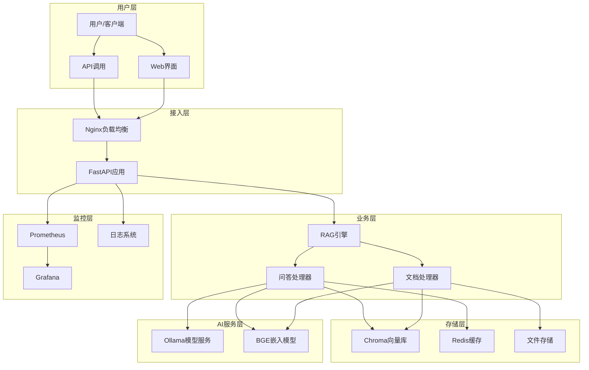

# 🤖 RAG知识库问答系统

<div align="center">


**基于FastAPI + Ollama + Chroma的企业级AI问答解决方案**

[功能特性](#-功能特性) • [快速开始](#-快速开始) • [API文档](#-api文档) • [部署指南](#-部署指南) • [贡献指南](#-贡献指南)

</div>

## 📋 项目简介

RAG知识库问答系统是一个基于检索增强生成(RAG)技术的智能问答平台，专为企业知识管理和智能客服场景设计。系统集成了先进的大语言模型、向量检索技术和缓存优化，提供高效、准确、可扩展的AI问答服务。

### 🎯 核心价值

- **🧠 智能问答**: 基于Ollama大语言模型，提供准确、上下文相关的答案
- **📚 知识管理**: 支持多格式文档处理，自动构建企业知识库
- **⚡ 高性能**: Redis缓存 + 向量检索，毫秒级响应速度
- **🛡️ 企业级**: 完整的安全防护、监控告警、容错机制
- **🔧 易部署**: Docker容器化，一键部署，开箱即用

## ✨ 功能特性

### 🤖 智能问答引擎
- **多模型支持**: 集成Ollama，支持Qwen、Llama等主流模型
- **上下文理解**: 基于文档内容生成准确、相关的答案
- **批量处理**: 支持批量问题处理，提升处理效率
- **历史记录**: 完整的问答历史追踪和统计分析

### 📄 文档处理系统
- **多格式支持**: PDF、TXT、Markdown、DOCX等格式
- **智能分块**: 自适应文本分块，保持语义完整性
- **向量化存储**: 基于BGE模型的高质量中文向量化
- **增量更新**: 支持文档增量添加和删除

### 🔍 检索优化
- **向量检索**: Chroma向量数据库，高效相似度搜索
- **混合检索**: 结合关键词和语义检索，提升准确率
- **相关性过滤**: 智能相关性阈值，过滤无关内容
- **缓存加速**: Redis缓存热点问题，显著提升响应速度

### 🛡️ 安全与监控
- **输入验证**: 全面的输入参数验证和安全过滤
- **访问控制**: API密钥认证，防止未授权访问
- **监控告警**: Prometheus + Grafana完整监控体系
- **日志审计**: 详细的操作日志和错误追踪

## 🏗️ 系统架构



## 🚀 快速开始

### 📋 环境要求

- **操作系统**: Ubuntu 20.04+ / CentOS 8+ / macOS 12+
- **Python**: 3.11+
- **Docker**: 20.10+
- **内存**: 8GB+ (推荐16GB+)
- **存储**: 20GB+ 可用空间
- **GPU**: 可选，支持CUDA加速

### 🐳 Docker部署 (推荐)

1. **克隆项目**
```bash
git clone https://github.com/your-username/RAG-Knowledge-QA-System.git
cd RAG-Knowledge-QA-System
```

2. **配置环境变量**
```bash
cp .env.example .env
# 编辑 .env 文件，配置您的参数
```

3. **启动服务**
```bash
# 启动所有服务
docker-compose up -d

# 查看服务状态
docker-compose ps

# 查看日志
docker-compose logs -f
```

4. **验证部署**
```bash
# 检查API健康状态
curl http://localhost:8000/health

# 访问API文档
open http://localhost:8000/docs
```

### 💻 本地开发部署

1. **安装依赖**
```bash
# 创建虚拟环境
python3 -m venv venv
source venv/bin/activate  # Linux/macOS
# venv\Scripts\activate  # Windows

# 安装依赖
pip install -r requirements.txt
```

2. **启动外部服务**
```bash
# 启动Ollama (需要单独安装)
ollama serve

# 启动Chroma
docker run -p 8002:8000 chromadb/chroma

# 启动Redis
docker run -p 6379:6379 redis:alpine
```

3. **启动应用**
```bash
# 开发模式
uvicorn src.main:app --reload --host 0.0.0.0 --port 8000

# 生产模式
gunicorn src.main:app -w 4 -k uvicorn.workers.UvicornWorker
```

## 📖 API文档

### 🔗 接口概览

| 功能模块 | 端点 | 方法 | 描述 |
|---------|------|------|------|
| 文档管理 | `/api/v1/documents/upload` | POST | 上传文档 |
| 文档管理 | `/api/v1/documents/{doc_id}` | DELETE | 删除文档 |
| 文档管理 | `/api/v1/documents` | GET | 文档列表 |
| 问答服务 | `/api/v1/qa/ask` | POST | 单问题问答 |
| 问答服务 | `/api/v1/qa/batch` | POST | 批量问答 |
| 问答服务 | `/api/v1/qa/history` | GET | 问答历史 |
| 系统管理 | `/health` | GET | 健康检查 |
| 系统管理 | `/metrics` | GET | 系统指标 |

### 💡 使用示例

#### 上传文档
```bash
curl -X POST "http://localhost:8000/api/v1/documents/upload" \
  -H "Content-Type: multipart/form-data" \
  -F "file=@document.pdf"
```

#### 问答查询
```bash
curl -X POST "http://localhost:8000/api/v1/qa/ask" \
  -H "Content-Type: application/json" \
  -d '{
    "question": "什么是人工智能？",
    "max_results": 5,
    "similarity_threshold": 0.7
  }'
```

#### 批量问答
```bash
curl -X POST "http://localhost:8000/api/v1/qa/batch" \
  -H "Content-Type: application/json" \
  -d '{
    "questions": [
      "什么是机器学习？",
      "深度学习的应用场景有哪些？"
    ]
  }'
```

详细API文档请访问: `http://localhost:8000/docs`

## 🔧 配置说明

### 📝 环境变量配置

```bash
# 应用配置
APP_NAME=RAG知识库问答系统
DEBUG=false
HOST=0.0.0.0
PORT=8000

# Ollama配置
OLLAMA_BASE_URL=http://ollama:11434
OLLAMA_MODEL=qwen2.5:7b-instruct
OLLAMA_TIMEOUT=300

# 向量数据库配置
CHROMA_HOST=chroma
CHROMA_PORT=8000
CHROMA_COLLECTION=rag_documents

# 嵌入模型配置
EMBEDDING_MODEL=BAAI/bge-large-zh-v1.5
EMBEDDING_DEVICE=cuda

# Redis缓存配置
REDIS_HOST=redis
REDIS_PORT=6379
CACHE_TTL=3600

# 文档处理配置
MAX_FILE_SIZE=52428800
CHUNK_SIZE=1000
```

### 🎛️ 高级配置

- **模型配置**: 支持多种Ollama模型切换
- **性能调优**: 可调整分块大小、检索数量等参数
- **缓存策略**: 可配置缓存TTL、清理策略
- **安全设置**: API密钥、CORS、速率限制等

## 📊 监控与运维

### 📈 性能监控

- **Prometheus指标**: 请求量、响应时间、错误率等
- **Grafana仪表板**: 可视化监控面板
- **健康检查**: 自动健康状态检测
- **日志聚合**: 结构化日志收集和分析

### 🔍 故障排查

```bash
# 查看服务状态
docker-compose ps

# 查看应用日志
docker-compose logs app

# 查看系统资源
docker stats

# 检查数据库连接
curl http://localhost:8002/api/v1/heartbeat
```

## 🧪 测试

### 🔬 运行测试

```bash
# 安装测试依赖
pip install -r requirements.txt

# 运行所有测试
pytest

# 运行特定测试
pytest tests/test_api.py

# 生成覆盖率报告
pytest --cov=src --cov-report=html
```

### 📋 测试覆盖

- **单元测试**: 核心模块功能测试
- **集成测试**: 模块间协作测试
- **性能测试**: 负载和压力测试
- **安全测试**: 安全漏洞和防护测试

## 📚 文档资源

- **[系统说明文档](docs/系统说明文档.md)**: 完整的系统文档
- **[API参考](http://localhost:8000/docs)**: 交互式API文档
- **[部署指南](docs/deployment.md)**: 详细部署说明
- **[开发指南](docs/development.md)**: 开发环境搭建
- **[故障排除](docs/troubleshooting.md)**: 常见问题解决

## 🤝 贡献指南

我们欢迎所有形式的贡献！请查看 [CONTRIBUTING.md](CONTRIBUTING.md) 了解详细信息。

### 🔄 开发流程

1. Fork 项目
2. 创建特性分支 (`git checkout -b feature/AmazingFeature`)
3. 提交更改 (`git commit -m 'Add some AmazingFeature'`)
4. 推送到分支 (`git push origin feature/AmazingFeature`)
5. 创建 Pull Request

### 📝 代码规范

- 遵循 PEP 8 Python代码规范
- 添加适当的注释和文档字符串
- 编写相应的单元测试
- 确保所有测试通过

## 📄 许可证

本项目采用 MIT 许可证 - 查看 [LICENSE](LICENSE) 文件了解详情。

## 🙏 致谢

- [FastAPI](https://fastapi.tiangolo.com/) - 现代、快速的Web框架
- [Ollama](https://ollama.ai/) - 本地大语言模型运行平台
- [Chroma](https://www.trychroma.com/) - 开源向量数据库
- [BGE](https://github.com/FlagOpen/FlagEmbedding) - 优秀的中文嵌入模型

## 📞 联系我们

- **项目主页**: [GitHub Repository](https://github.com/your-username/RAG-Knowledge-QA-System)
- **问题反馈**: [Issues](https://github.com/your-username/RAG-Knowledge-QA-System/issues)
- **功能建议**: [Discussions](https://github.com/your-username/RAG-Knowledge-QA-System/discussions)

---

<div align="center">

**⭐ 如果这个项目对您有帮助，请给我们一个星标！**

Made with ❤️ by RAG Team

</div>