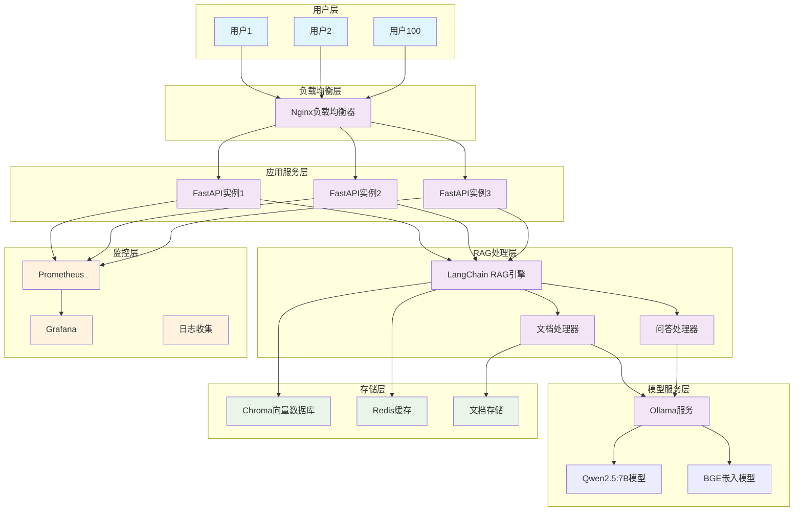
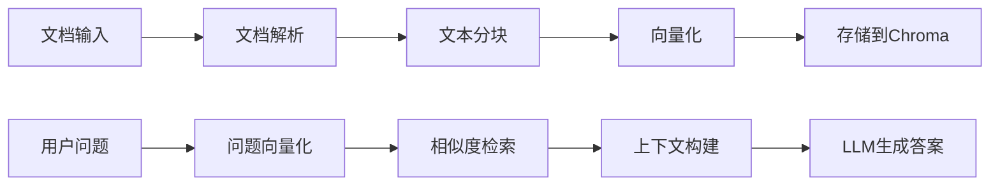
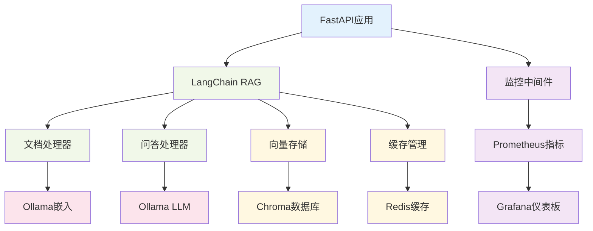
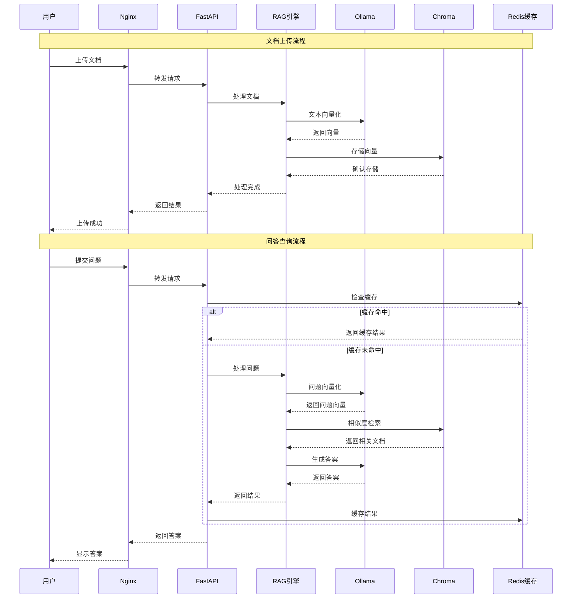

# RAG知识库问答系统优化 - 架构设计文档

## 设计概述

**设计目标**: 构建高性能、可扩展的中文RAG知识库问答系统  
**设计原则**: 微服务架构、容器化部署、性能优先、可监控  
**设计时间**: 2025-01-08  

## 整体架构图



## 分层设计详述

### 1. 负载均衡层
**组件**: Nginx  
**职责**: 
- 请求分发和负载均衡
- SSL终止和安全防护
- 静态资源服务
- 健康检查和故障转移

**配置要点**:
```nginx
upstream fastapi_backend {
    least_conn;
    server api1:8000 max_fails=3 fail_timeout=30s;
    server api2:8000 max_fails=3 fail_timeout=30s;
    server api3:8000 max_fails=3 fail_timeout=30s;
}
```

### 2. 应用服务层
**组件**: FastAPI (3个实例)  
**职责**:
- RESTful API接口提供
- 请求验证和参数处理
- 业务逻辑协调
- 响应格式化和错误处理

**核心接口设计**:
```python
# 文档上传接口
POST /api/v1/documents/upload
# 问答查询接口  
POST /api/v1/chat/query
# 健康检查接口
GET /api/v1/health
# 系统状态接口
GET /api/v1/status
```

### 3. RAG处理层
**组件**: LangChain RAG引擎  
**职责**:
- 文档解析和预处理
- 文本分块和向量化
- 相似度检索和排序
- 上下文构建和答案生成

**处理流程**:


### 4. 模型服务层
**组件**: Ollama + 模型  
**职责**:
- 大语言模型推理服务
- 嵌入模型向量生成
- 模型生命周期管理
- 推理性能优化

**模型配置**:
- **主模型**: Qwen2.5:7B-Instruct (中文优化)
- **嵌入模型**: bge-large-zh-v1.5 (中文语义)
- **量化**: 启用4-bit量化减少显存占用
- **并发**: 支持多请求并行处理

### 5. 存储层
**组件**: Chroma + Redis + 文件存储  
**职责**:
- 向量数据持久化存储
- 查询结果缓存
- 原始文档文件存储
- 元数据管理

**存储策略**:
```python
# Chroma配置
chroma_config = {
    "persist_directory": "/data/chroma",
    "collection_name": "rag_documents",
    "embedding_function": "bge-large-zh-v1.5"
}

# Redis缓存策略
redis_config = {
    "host": "redis",
    "port": 6379,
    "db": 0,
    "ttl": 3600  # 1小时缓存
}
```

## 核心组件设计

### 文档处理组件
```python
class DocumentProcessor:
    """文档处理器"""
    
    def __init__(self):
        self.supported_formats = ['.pdf', '.docx', '.txt', '.md']
        self.chunk_size = 1000
        self.chunk_overlap = 200
    
    async def process_document(self, file_path: str) -> List[Document]:
        """处理单个文档"""
        # 文档解析
        # 文本清洗
        # 智能分块
        # 元数据提取
        pass
    
    async def batch_process(self, file_paths: List[str]) -> List[Document]:
        """批量处理文档"""
        pass
```

### 问答处理组件
```python
class QAProcessor:
    """问答处理器"""
    
    def __init__(self, llm, embeddings, vectorstore, cache):
        self.llm = llm
        self.embeddings = embeddings
        self.vectorstore = vectorstore
        self.cache = cache
    
    async def query(self, question: str, top_k: int = 5) -> Dict:
        """处理问答查询"""
        # 缓存检查
        # 问题向量化
        # 相似度检索
        # 上下文构建
        # LLM生成答案
        # 结果缓存
        pass
```

## 模块依赖关系图



## 接口契约定义

### 1. 文档上传接口
```yaml
POST /api/v1/documents/upload
Content-Type: multipart/form-data

Request:
  files: List[File]  # 支持多文件上传
  metadata: Optional[Dict]  # 文档元数据

Response:
  status: str  # success/error
  document_ids: List[str]  # 文档ID列表
  processed_count: int  # 处理成功数量
  errors: List[str]  # 错误信息
```

### 2. 问答查询接口
```yaml
POST /api/v1/chat/query
Content-Type: application/json

Request:
  question: str  # 用户问题
  top_k: Optional[int] = 5  # 检索文档数量
  temperature: Optional[float] = 0.7  # 生成温度

Response:
  status: str  # success/error
  answer: str  # 生成的答案
  sources: List[Dict]  # 参考来源
  confidence: float  # 置信度
  response_time: float  # 响应时间
```

### 3. 健康检查接口
```yaml
GET /api/v1/health

Response:
  status: str  # healthy/unhealthy
  components: Dict  # 各组件状态
  timestamp: str  # 检查时间
```

## 数据流向图



## 异常处理策略

### 1. 服务级异常处理
```python
class RAGExceptionHandler:
    """RAG系统异常处理器"""
    
    @staticmethod
    async def handle_model_error(error: Exception) -> Dict:
        """模型服务异常处理"""
        return {
            "status": "error",
            "message": "模型服务暂时不可用",
            "retry_after": 30
        }
    
    @staticmethod
    async def handle_storage_error(error: Exception) -> Dict:
        """存储服务异常处理"""
        return {
            "status": "error", 
            "message": "存储服务异常",
            "fallback": "使用缓存数据"
        }
```

### 2. 降级策略
- **模型服务降级**: 使用更小的模型或预设回答
- **向量检索降级**: 使用关键词匹配
- **缓存降级**: 返回历史相似问题答案

### 3. 重试机制
- **指数退避重试**: 1s, 2s, 4s, 8s
- **最大重试次数**: 3次
- **熔断器**: 连续失败5次后熔断30秒

## 性能优化设计

### 1. 缓存策略
```python
# 多级缓存设计
class CacheManager:
    def __init__(self):
        self.l1_cache = {}  # 内存缓存
        self.l2_cache = redis_client  # Redis缓存
        self.l3_cache = disk_cache  # 磁盘缓存
```

### 2. 并发优化
- **异步处理**: 全链路异步I/O
- **连接池**: 数据库连接池管理
- **队列机制**: 请求队列和优先级调度

### 3. 资源优化
- **模型量化**: 4-bit量化减少显存占用
- **批处理**: 批量向量化和推理
- **内存管理**: 及时释放不用的资源

## 监控和日志设计

### 1. 监控指标
```python
# Prometheus指标定义
REQUEST_COUNT = Counter('rag_requests_total', '总请求数')
REQUEST_DURATION = Histogram('rag_request_duration_seconds', '请求耗时')
MODEL_INFERENCE_TIME = Histogram('model_inference_seconds', '模型推理时间')
CACHE_HIT_RATE = Gauge('cache_hit_rate', '缓存命中率')
```

### 2. 日志策略
- **结构化日志**: JSON格式统一日志
- **日志级别**: DEBUG/INFO/WARN/ERROR
- **日志轮转**: 按大小和时间轮转
- **敏感信息**: 脱敏处理用户数据

## 部署架构设计

### Docker Compose配置
```yaml
version: '3.8'
services:
  nginx:
    image: nginx:alpine
    ports: ["80:80"]
    
  fastapi:
    build: ./app
    replicas: 3
    
  ollama:
    image: ollama/ollama
    volumes: ["./models:/root/.ollama"]
    
  chroma:
    image: chromadb/chroma
    volumes: ["./data:/chroma/data"]
    
  redis:
    image: redis:alpine
    
  prometheus:
    image: prom/prometheus
    
  grafana:
    image: grafana/grafana
```

## 安全设计

### 1. 接口安全
- **API密钥认证**: 请求头携带API Key
- **请求限流**: 每用户每分钟最多60请求
- **输入验证**: 严格的参数校验和过滤

### 2. 数据安全
- **数据加密**: 敏感数据AES加密存储
- **访问控制**: 基于角色的权限控制
- **审计日志**: 完整的操作审计记录

这个架构设计确保了系统的高性能、高可用性和可扩展性，满足100并发用户和5秒响应时间的要求。