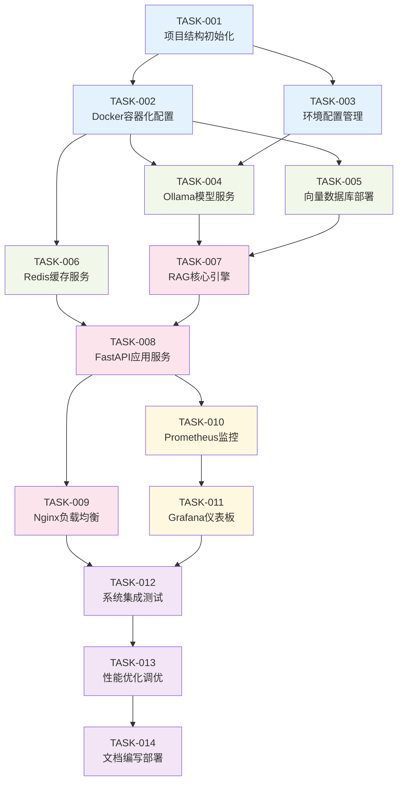

# RAG知识库问答系统优化 - 任务拆分文档

## 任务拆分概述

**拆分原则**: 按功能模块分解，确保任务原子性和独立性  
**拆分目标**: 每个任务可独立编译测试，复杂度可控  
**执行顺序**: 按依赖关系顺序执行  

## 子任务列表

### 🏗️ 基础设施任务 (Infrastructure Tasks)

#### 任务1: 项目结构初始化
**任务ID**: TASK-001  
**优先级**: 高  
**预估时间**: 30分钟  

**输入契约**:
- 前置依赖: 无
- 输入数据: 项目需求文档
- 环境依赖: Docker, Python 3.9+

**输出契约**:
- 输出数据: 完整的项目目录结构
- 交付物: 项目骨架代码
- 验收标准: 目录结构符合设计规范

**实现约束**:
- 技术栈: Python, Docker
- 接口规范: RESTful API
- 质量要求: 代码规范符合PEP8

**依赖关系**:
- 后置任务: TASK-002, TASK-003
- 并行任务: 无

---

#### 任务2: Docker容器化配置
**任务ID**: TASK-002  
**优先级**: 高  
**预估时间**: 45分钟  

**输入契约**:
- 前置依赖: TASK-001
- 输入数据: 项目结构
- 环境依赖: Docker, Docker Compose

**输出契约**:
- 输出数据: Docker配置文件
- 交付物: docker-compose.yml, Dockerfile
- 验收标准: 容器可正常启动和通信

**实现约束**:
- 技术栈: Docker, Docker Compose
- 接口规范: 容器间网络通信
- 质量要求: 资源限制合理配置

**依赖关系**:
- 前置任务: TASK-001
- 后置任务: TASK-004, TASK-005
- 并行任务: TASK-003

---

#### 任务3: 环境配置和依赖管理
**任务ID**: TASK-003  
**优先级**: 高  
**预估时间**: 30分钟  

**输入契约**:
- 前置依赖: TASK-001
- 输入数据: 技术选型清单
- 环境依赖: Python 3.9+

**输出契约**:
- 输出数据: 依赖配置文件
- 交付物: requirements.txt, .env.example
- 验收标准: 依赖安装无冲突

**实现约束**:
- 技术栈: Python, pip
- 接口规范: 环境变量配置
- 质量要求: 版本锁定，安全配置

**依赖关系**:
- 前置任务: TASK-001
- 后置任务: TASK-004
- 并行任务: TASK-002

---

### 🤖 模型服务任务 (Model Service Tasks)

#### 任务4: Ollama模型服务部署
**任务ID**: TASK-004  
**优先级**: 高  
**预估时间**: 60分钟  

**输入契约**:
- 前置依赖: TASK-002, TASK-003
- 输入数据: 模型配置参数
- 环境依赖: Docker, GPU驱动

**输出契约**:
- 输出数据: 模型服务接口
- 交付物: Ollama容器配置
- 验收标准: 模型可正常推理

**实现约束**:
- 技术栈: Ollama, Docker
- 接口规范: HTTP API
- 质量要求: 显存使用<8GB

**依赖关系**:
- 前置任务: TASK-002, TASK-003
- 后置任务: TASK-007
- 并行任务: TASK-005, TASK-006

---

#### 任务5: 向量数据库部署
**任务ID**: TASK-005  
**优先级**: 高  
**预估时间**: 45分钟  

**输入契约**:
- 前置依赖: TASK-002
- 输入数据: 数据库配置
- 环境依赖: Docker

**输出契约**:
- 输出数据: 向量数据库服务
- 交付物: Chroma容器配置
- 验收标准: 数据库可正常读写

**实现约束**:
- 技术栈: Chroma, Docker
- 接口规范: HTTP API
- 质量要求: 数据持久化

**依赖关系**:
- 前置任务: TASK-002
- 后置任务: TASK-007
- 并行任务: TASK-004, TASK-006

---

#### 任务6: Redis缓存服务部署
**任务ID**: TASK-006  
**优先级**: 中  
**预估时间**: 30分钟  

**输入契约**:
- 前置依赖: TASK-002
- 输入数据: 缓存配置
- 环境依赖: Docker

**输出契约**:
- 输出数据: 缓存服务
- 交付物: Redis容器配置
- 验收标准: 缓存读写正常

**实现约束**:
- 技术栈: Redis, Docker
- 接口规范: Redis协议
- 质量要求: 内存使用合理

**依赖关系**:
- 前置任务: TASK-002
- 后置任务: TASK-008
- 并行任务: TASK-004, TASK-005

---

### 🔧 核心功能任务 (Core Function Tasks)

#### 任务7: RAG核心引擎开发
**任务ID**: TASK-007  
**优先级**: 高  
**预估时间**: 90分钟  

**输入契约**:
- 前置依赖: TASK-004, TASK-005
- 输入数据: 模型和数据库接口
- 环境依赖: Python, LangChain

**输出契约**:
- 输出数据: RAG处理引擎
- 交付物: 文档处理器、问答处理器
- 验收标准: 可处理文档和回答问题

**实现约束**:
- 技术栈: LangChain, Python
- 接口规范: 异步处理
- 质量要求: 响应时间<5秒

**依赖关系**:
- 前置任务: TASK-004, TASK-005
- 后置任务: TASK-008
- 并行任务: 无

---

#### 任务8: FastAPI应用服务开发
**任务ID**: TASK-008  
**优先级**: 高  
**预估时间**: 75分钟  

**输入契约**:
- 前置依赖: TASK-006, TASK-007
- 输入数据: RAG引擎和缓存服务
- 环境依赖: Python, FastAPI

**输出契约**:
- 输出数据: Web API服务
- 交付物: API接口实现
- 验收标准: 接口功能完整

**实现约束**:
- 技术栈: FastAPI, Python
- 接口规范: RESTful API
- 质量要求: 支持100并发

**依赖关系**:
- 前置任务: TASK-006, TASK-007
- 后置任务: TASK-009
- 并行任务: 无

---

#### 任务9: Nginx负载均衡配置
**任务ID**: TASK-009  
**优先级**: 中  
**预估时间**: 45分钟  

**输入契约**:
- 前置依赖: TASK-008
- 输入数据: API服务配置
- 环境依赖: Docker, Nginx

**输出契约**:
- 输出数据: 负载均衡服务
- 交付物: Nginx配置文件
- 验收标准: 请求分发正常

**实现约束**:
- 技术栈: Nginx, Docker
- 接口规范: HTTP代理
- 质量要求: 支持健康检查

**依赖关系**:
- 前置任务: TASK-008
- 后置任务: TASK-012
- 并行任务: TASK-010, TASK-011

---

### 📊 监控运维任务 (Monitoring & Operations Tasks)

#### 任务10: Prometheus监控部署
**任务ID**: TASK-010  
**优先级**: 中  
**预估时间**: 45分钟  

**输入契约**:
- 前置依赖: TASK-008
- 输入数据: 应用指标配置
- 环境依赖: Docker, Prometheus

**输出契约**:
- 输出数据: 监控数据收集
- 交付物: Prometheus配置
- 验收标准: 指标收集正常

**实现约束**:
- 技术栈: Prometheus, Docker
- 接口规范: HTTP指标接口
- 质量要求: 数据准确性

**依赖关系**:
- 前置任务: TASK-008
- 后置任务: TASK-011
- 并行任务: TASK-009

---

#### 任务11: Grafana仪表板配置
**任务ID**: TASK-011  
**优先级**: 中  
**预估时间**: 60分钟  

**输入契约**:
- 前置依赖: TASK-010
- 输入数据: 监控指标数据
- 环境依赖: Docker, Grafana

**输出契约**:
- 输出数据: 可视化仪表板
- 交付物: Grafana配置和面板
- 验收标准: 图表显示正常

**实现约束**:
- 技术栈: Grafana, Docker
- 接口规范: Prometheus数据源
- 质量要求: 实时性和美观性

**依赖关系**:
- 前置任务: TASK-010
- 后置任务: TASK-012
- 并行任务: TASK-009

---

### 🧪 测试验证任务 (Testing & Validation Tasks)

#### 任务12: 系统集成测试
**任务ID**: TASK-012  
**优先级**: 高  
**预估时间**: 90分钟  

**输入契约**:
- 前置依赖: TASK-009, TASK-011
- 输入数据: 完整系统
- 环境依赖: 测试数据集

**输出契约**:
- 输出数据: 测试报告
- 交付物: 测试用例和结果
- 验收标准: 所有测试通过

**实现约束**:
- 技术栈: pytest, 性能测试工具
- 接口规范: 自动化测试
- 质量要求: 覆盖率>80%

**依赖关系**:
- 前置任务: TASK-009, TASK-011
- 后置任务: TASK-013
- 并行任务: 无

---

#### 任务13: 性能优化和调优
**任务ID**: TASK-013  
**优先级**: 中  
**预估时间**: 75分钟  

**输入契约**:
- 前置依赖: TASK-012
- 输入数据: 性能测试结果
- 环境依赖: 性能分析工具

**输出契约**:
- 输出数据: 优化后的系统
- 交付物: 性能调优报告
- 验收标准: 性能指标达标

**实现约束**:
- 技术栈: 性能分析工具
- 接口规范: 系统调优
- 质量要求: 响应时间<5秒

**依赖关系**:
- 前置任务: TASK-012
- 后置任务: TASK-014
- 并行任务: 无

---

#### 任务14: 文档编写和部署指南
**任务ID**: TASK-014  
**优先级**: 中  
**预估时间**: 60分钟  

**输入契约**:
- 前置依赖: TASK-013
- 输入数据: 完整系统和测试结果
- 环境依赖: 文档工具

**输出契约**:
- 输出数据: 完整文档
- 交付物: README, 部署指南, API文档
- 验收标准: 文档完整准确

**实现约束**:
- 技术栈: Markdown, OpenAPI
- 接口规范: 标准化文档格式
- 质量要求: 清晰易懂

**依赖关系**:
- 前置任务: TASK-013
- 后置任务: 无
- 并行任务: 无

---

## 任务依赖关系图

## 执行计划

### 第一阶段: 基础设施搭建 (预计2小时)
- TASK-001: 项目结构初始化 (30分钟)
- TASK-002: Docker容器化配置 (45分钟) 
- TASK-003: 环境配置管理 (30分钟)

### 第二阶段: 服务部署 (预计2.5小时)
- TASK-004: Ollama模型服务 (60分钟)
- TASK-005: 向量数据库部署 (45分钟)
- TASK-006: Redis缓存服务 (30分钟)

### 第三阶段: 核心功能开发 (预计3.5小时)
- TASK-007: RAG核心引擎 (90分钟)
- TASK-008: FastAPI应用服务 (75分钟)
- TASK-009: Nginx负载均衡 (45分钟)

### 第四阶段: 监控运维 (预计1.5小时)
- TASK-010: Prometheus监控 (45分钟)
- TASK-011: Grafana仪表板 (60分钟)

### 第五阶段: 测试优化 (预计4小时)
- TASK-012: 系统集成测试 (90分钟)
- TASK-013: 性能优化调优 (75分钟)
- TASK-014: 文档编写部署 (60分钟)

**总预计时间**: 13.5小时  
**建议执行周期**: 2-3个工作日  

## 风险评估

### 高风险任务
- **TASK-004**: 模型服务部署 - GPU驱动兼容性风险
- **TASK-007**: RAG核心引擎 - 复杂度较高，集成风险
- **TASK-012**: 系统集成测试 - 可能发现系统性问题

### 风险应对策略
1. **提前验证**: 关键依赖提前验证可用性
2. **增量测试**: 每个任务完成后立即测试
3. **回滚机制**: 保留每个阶段的可工作版本
4. **文档记录**: 详细记录问题和解决方案

## 质量保证

### 代码质量
- 遵循PEP8代码规范
- 函数级注释覆盖率100%
- 单元测试覆盖率>80%

### 性能质量
- 响应时间<5秒
- 支持100并发用户
- 系统可用性>80%

### 安全质量
- API密钥安全管理
- 输入验证和过滤
- 敏感数据加密存储

这个任务拆分确保了每个子任务都是原子性的、可独立验证的，并且按照合理的依赖关系组织，便于高效执行和质量控制。