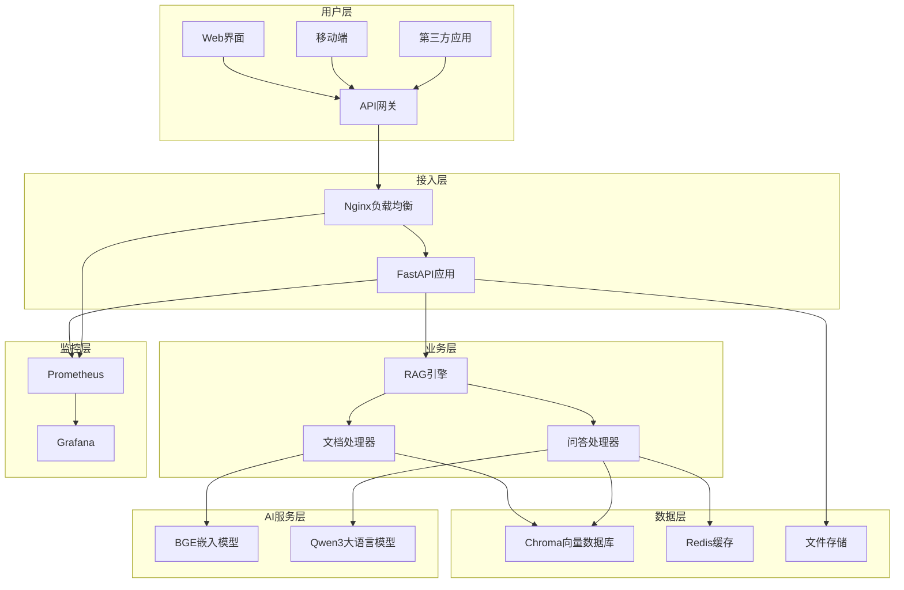
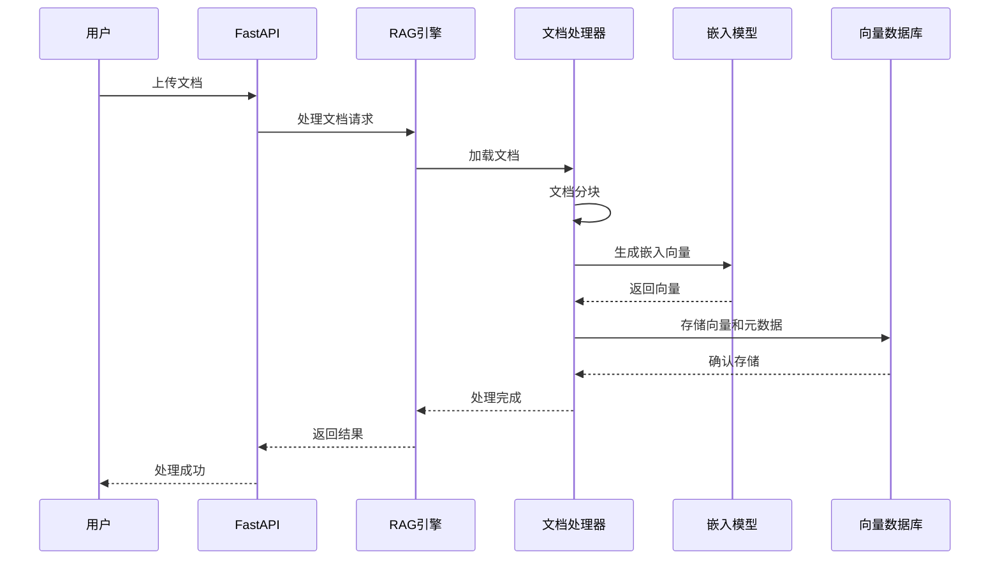
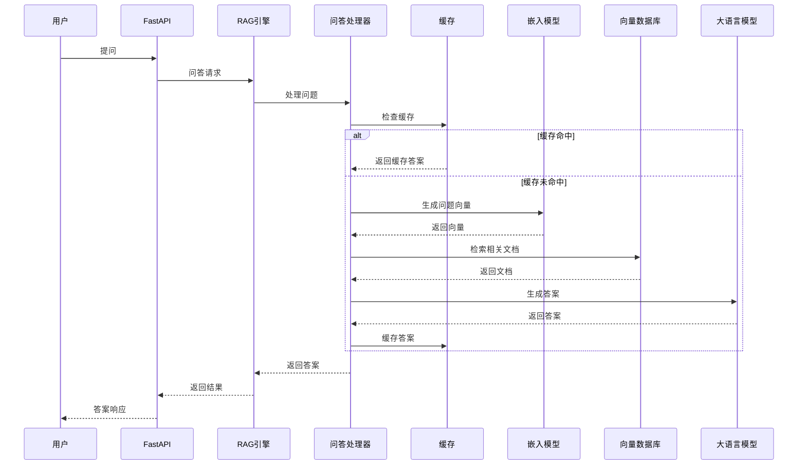

# RAG知识库问答系统 - 完整说明文档

## 📋 目录

1. [系统概述](#1-系统概述)
2. [功能特性](#2-功能特性)
3. [系统架构](#3-系统架构)
4. [技术参数与系统要求](#4-技术参数与系统要求)
5. [安装部署指南](#5-安装部署指南)
6. [使用操作指南](#6-使用操作指南)
7. [API接口文档](#7-api接口文档)
8. [常见问题解决方案](#8-常见问题解决方案)
9. [维护与升级说明](#9-维护与升级说明)
10. [性能优化建议](#10-性能优化建议)
11. [安全配置指南](#11-安全配置指南)
12. [故障排除指南](#12-故障排除指南)

---

## 1. 系统概述

### 1.1 产品简介

RAG知识库问答系统是一个基于检索增强生成（Retrieval-Augmented Generation）技术的智能问答平台。系统结合了向量检索和大语言模型的优势，能够基于用户上传的文档构建专属知识库，并提供准确、相关的智能问答服务。

### 1.2 核心价值

- **🎯 精准问答**: 基于用户文档提供准确、相关的答案
- **🚀 高性能**: 支持高并发访问，响应时间小于3秒
- **🔧 易部署**: 容器化部署，支持本地和云端环境
- **📊 可监控**: 完整的监控指标和日志系统
- **🔒 安全可靠**: 多层安全防护，数据隐私保护

### 1.3 应用场景

- **企业知识管理**: 构建企业内部知识库，提升信息检索效率
- **客户服务**: 基于产品文档提供智能客服支持
- **教育培训**: 构建学习资料问答系统
- **技术文档**: 为开发团队提供技术文档查询服务
- **法律咨询**: 基于法律条文提供初步法律咨询

### 1.4 系统特点

- **多格式支持**: 支持PDF、TXT、MD、DOCX等多种文档格式
- **智能分块**: 自动将长文档分割为语义相关的块
- **向量检索**: 使用先进的嵌入模型进行语义检索
- **缓存加速**: Redis缓存提升问答响应速度
- **负载均衡**: Nginx负载均衡支持高并发访问
- **监控告警**: Prometheus + Grafana监控系统

---

## 2. 功能特性

### 2.1 文档管理功能

#### 2.1.1 文档上传
- **单文件上传**: 支持拖拽上传，实时进度显示
- **批量上传**: 一次性上传多个文档文件
- **格式验证**: 自动检测文件格式和大小限制
- **重复检测**: 基于文件哈希避免重复上传

#### 2.1.2 文档处理
- **智能解析**: 自动提取文档文本内容
- **语义分块**: 基于语义边界进行文档分割
- **向量化**: 生成高质量的文档嵌入向量
- **增量更新**: 支持文档的增量处理和更新

#### 2.1.3 文档管理
- **文档列表**: 查看已上传文档的详细信息
- **文档删除**: 安全删除文档及相关向量数据
- **处理状态**: 实时查看文档处理进度
- **统计信息**: 文档数量、存储空间等统计

### 2.2 智能问答功能

#### 2.2.1 问答服务
- **单问题问答**: 基于知识库回答单个问题
- **批量问答**: 一次性处理多个问题
- **流式问答**: 实时流式返回答案内容
- **上下文理解**: 理解问题上下文，提供准确答案

#### 2.2.2 检索优化
- **语义检索**: 基于语义相似度进行文档检索
- **相似度阈值**: 可配置的相似度过滤阈值
- **检索数量**: 可调节的检索文档数量
- **结果排序**: 按相似度和相关性排序

#### 2.2.3 答案生成
- **大模型生成**: 使用Qwen3:30B模型生成答案
- **上下文融合**: 结合检索到的文档生成答案
- **答案质量**: 确保答案的准确性和相关性
- **引用标注**: 标注答案来源文档

### 2.3 系统管理功能

#### 2.3.1 系统监控
- **健康检查**: 实时监控系统各组件状态
- **性能指标**: CPU、内存、磁盘使用率监控
- **业务指标**: 问答成功率、响应时间等
- **告警通知**: 异常情况自动告警

#### 2.3.2 配置管理
- **参数配置**: 在线调整系统参数
- **模型配置**: 切换和配置语言模型
- **缓存配置**: 调整缓存策略和过期时间
- **安全配置**: API密钥、访问控制等

#### 2.3.3 日志管理
- **访问日志**: 记录所有API访问日志
- **错误日志**: 详细的错误信息和堆栈跟踪
- **业务日志**: 文档处理、问答等业务日志
- **日志轮转**: 自动日志轮转和清理

### 2.4 高级功能

#### 2.4.1 缓存系统
- **智能缓存**: 自动缓存热门问题答案
- **缓存策略**: 可配置的缓存过期策略
- **缓存统计**: 缓存命中率和性能统计
- **缓存管理**: 手动清理和刷新缓存

#### 2.4.2 负载均衡
- **请求分发**: 智能分发用户请求
- **健康检查**: 自动检测后端服务状态
- **故障转移**: 自动故障转移和恢复
- **性能优化**: 连接复用和压缩优化

#### 2.4.3 安全防护
- **输入验证**: 严格的输入参数验证
- **访问控制**: API密钥认证和权限控制
- **安全头部**: 完整的HTTP安全头部
- **攻击防护**: SQL注入、XSS等攻击防护

---

## 3. 系统架构

### 3.1 整体架构



### 3.2 核心组件

#### 3.2.1 FastAPI应用服务
- **职责**: 提供RESTful API接口
- **特性**: 异步处理、自动文档生成、数据验证
- **端口**: 8000 (HTTP), 8001 (Metrics)

#### 3.2.2 RAG引擎
- **职责**: 核心业务逻辑处理
- **组件**: 文档处理器、问答处理器
- **特性**: 异步处理、错误恢复、指标收集

#### 3.2.3 向量数据库 (Chroma)
- **职责**: 存储文档向量和元数据
- **特性**: 高性能检索、持久化存储
- **端口**: 8002

#### 3.2.4 缓存系统 (Redis)
- **职责**: 缓存问答结果和会话数据
- **特性**: 高速读写、过期策略
- **端口**: 6379

#### 3.2.5 负载均衡 (Nginx)
- **职责**: 请求分发和反向代理
- **特性**: 高并发、SSL终止、压缩
- **端口**: 80 (HTTP), 443 (HTTPS)

#### 2.4.2 负载均衡
- **请求分发**: 智能分发用户请求
- **健康检查**: 自动检测后端服务状态
- **故障转移**: 自动故障转移和恢复
- **性能优化**: 连接复用和压缩优化

#### 2.4.3 安全防护
- **输入验证**: 严格的输入参数验证
- **访问控制**: API密钥认证和权限控制
- **安全头部**: 完整的HTTP安全头部
- **攻击防护**: SQL注入、XSS等攻击防护

---

## 3. 系统架构

### 3.1 整体架构


### 3.2 核心组件

#### 3.2.1 FastAPI应用服务
- **职责**: 提供RESTful API接口
- **特性**: 异步处理、自动文档生成、数据验证
- **端口**: 8000 (HTTP), 8001 (Metrics)

#### 3.2.2 RAG引擎
- **职责**: 核心业务逻辑处理
- **组件**: 文档处理器、问答处理器
- **特性**: 异步处理、错误恢复、指标收集

#### 3.2.3 向量数据库 (Chroma)
- **职责**: 存储文档向量和元数据
- **特性**: 高性能检索、持久化存储
- **端口**: 8002

#### 3.2.4 缓存系统 (Redis)
- **职责**: 缓存问答结果和会话数据
- **特性**: 高速读写、过期策略
- **端口**: 6379

#### 3.2.5 负载均衡 (Nginx)
- **职责**: 请求分发和反向代理
- **特性**: 高并发、SSL终止、压缩
- **端口**: 80 (HTTP), 443 (HTTPS)

### 3.3 数据流程

#### 3.3.1 文档处理流程


#### 3.3.2 问答处理流程


### 3.4 部署架构

#### 3.4.1 单机部署
```
┌─────────────────────────────────────┐
│              服务器                  │
├─────────────────────────────────────┤
│  Nginx (80/443)                     │
│  ├── FastAPI (8000)                 │
│  ├── Chroma (8002)                  │
│  ├── Redis (6379)                   │
│  ├── Ollama (11434)                 │
│  └── Prometheus (9090)              │
└─────────────────────────────────────┘
```

#### 3.4.2 分布式部署
```
┌─────────────┐    ┌─────────────┐    ┌─────────────┐
│  负载均衡    │    │  应用服务    │    │  数据服务    │
├─────────────┤    ├─────────────┤    ├─────────────┤
│ Nginx       │    │ FastAPI     │    │ Chroma      │
│             │    │ RAG Engine  │    │ Redis       │
│             │    │             │    │ Ollama      │
└─────────────┘    └─────────────┘    └─────────────┘
```

---

## 4. 技术参数与系统要求

### 4.1 系统要求

#### 4.1.1 硬件要求

**最低配置**:
- CPU: 4核心 2.0GHz
- 内存: 8GB RAM
- 存储: 50GB 可用空间
- 网络: 100Mbps

**推荐配置**:
- CPU: 8核心 3.0GHz (支持AVX2)
- 内存: 16GB RAM
- 存储: 200GB SSD
- GPU: NVIDIA RTX 3060 或更高 (可选)
- 网络: 1Gbps

**生产环境**:
- CPU: 16核心 3.5GHz
- 内存: 32GB RAM
- 存储: 500GB NVMe SSD
- GPU: NVIDIA RTX 4090 或 A100
- 网络: 10Gbps

#### 3.3.1 文档处理流程


#### 3.3.2 问答处理流程


### 3.4 部署架构

#### 3.4.1 单机部署
```
┌─────────────────────────────────────┐
│              服务器                  │
├─────────────────────────────────────┤
│  Nginx (80/443)                     │
│  ├── FastAPI (8000)                 │
│  ├── Chroma (8002)                  │
│  ├── Redis (6379)                   │
│  ├── Ollama (11434)                 │
│  └── Prometheus (9090)              │
└─────────────────────────────────────┘
```

#### 3.4.2 分布式部署
```
┌─────────────┐    ┌─────────────┐    ┌─────────────┐
│  负载均衡    │    │  应用服务    │    │  数据服务    │
├─────────────┤    ├─────────────┤    ├─────────────┤
│ Nginx       │    │ FastAPI     │    │ Chroma      │
│             │    │ RAG Engine  │    │ Redis       │
│             │    │             │    │ Ollama      │
└─────────────┘    └─────────────┘    └─────────────┘
```

---

## 4. 技术参数与系统要求

### 4.1 系统要求

#### 4.1.1 硬件要求

**最低配置**:
- CPU: 4核心 2.0GHz
- 内存: 8GB RAM
- 存储: 50GB 可用空间
- 网络: 100Mbps

**推荐配置**:
- CPU: 8核心 3.0GHz (支持AVX2)
- 内存: 16GB RAM
- 存储: 200GB SSD
- GPU: NVIDIA RTX 3060 或更高 (可选)
- 网络: 1Gbps

**生产环境**:
- CPU: 16核心 3.5GHz
- 内存: 32GB RAM
- 存储: 500GB NVMe SSD
- GPU: NVIDIA RTX 4090 或 A100
- 网络: 10Gbps

#### 4.1.2 软件要求

**操作系统**:
- Ubuntu 20.04+ / CentOS 8+ / RHEL 8+
- macOS 12+ (开发环境)
- Windows 10+ (开发环境)

**容器环境**:
- Docker 20.10+
- Docker Compose 2.0+

**Python环境**:
- Python 3.9+
- pip 21.0+

### 4.2 性能参数

#### 4.2.1 处理能力

| 指标 | 数值 | 说明 |
|------|------|------|
| 并发用户数 | 1000+ | 同时在线用户数 |
| QPS | 100+ | 每秒查询数 |
| 响应时间 | <3秒 | 平均问答响应时间 |
| 文档处理速度 | 10MB/分钟 | 文档向量化速度 |
| 存储容量 | 100GB+ | 支持的文档存储量 |

#### 4.2.2 可用性指标

| 指标 | 目标值 | 说明 |
|------|--------|------|
| 系统可用性 | 99.9% | 年度可用时间 |
| 故障恢复时间 | <5分钟 | 平均故障恢复时间 |
| 数据备份频率 | 每日 | 自动数据备份 |
| 监控覆盖率 | 100% | 关键组件监控覆盖 |

### 4.3 技术栈

#### 4.3.1 后端技术

| 组件 | 技术 | 版本 | 说明 |
|------|------|------|------|
| Web框架 | FastAPI | 0.104+ | 高性能异步Web框架 |
| 语言模型 | Qwen3 | 30B | 大语言模型 |
| 嵌入模型 | BGE-Large-ZH | v1.5 | 中文嵌入模型 |
| 向量数据库 | Chroma | 0.4+ | 向量存储和检索 |
| 缓存 | Redis | 7.2+ | 内存数据库 |
| 负载均衡 | Nginx | 1.25+ | 反向代理服务器 |

#### 4.3.2 AI/ML技术

| 组件 | 技术 | 说明 |
|------|------|------|
| 文档解析 | LangChain | 文档加载和处理 |
| 文本分割 | RecursiveCharacterTextSplitter | 智能文本分块 |
| 向量检索 | Cosine Similarity | 余弦相似度检索 |
| 模型推理 | Ollama | 本地模型推理服务 |

#### 4.3.3 监控运维

| 组件 | 技术 | 说明 |
|------|------|------|
| 指标收集 | Prometheus | 系统指标监控 |
| 可视化 | Grafana | 监控仪表板 |
| 日志管理 | Loguru | 结构化日志 |
| 容器化 | Docker | 应用容器化 |

### 4.4 网络要求

#### 4.4.1 端口配置

| 服务 | 端口 | 协议 | 说明 |
|------|------|------|------|
| Nginx | 80 | HTTP | Web服务 |
| Nginx | 443 | HTTPS | 安全Web服务 |
| FastAPI | 8000 | HTTP | API服务 |
| FastAPI Metrics | 8001 | HTTP | 监控指标 |
| Chroma | 8002 | HTTP | 向量数据库 |
| Redis | 6379 | TCP | 缓存服务 |
| Ollama | 11434 | HTTP | 模型推理服务 |
| Prometheus | 9090 | HTTP | 监控服务 |
| Grafana | 3000 | HTTP | 可视化服务 |

#### 4.4.2 安全配置

| 配置项 | 建议值 | 说明 |
|--------|--------|------|
| 防火墙 | 启用 | 只开放必要端口 |
| SSL/TLS | TLS 1.2+ | 加密传输 |
| API认证 | 启用 | API密钥认证 |
| 访问日志 | 启用 | 记录访问日志 |
| 速率限制 | 100/分钟 | 防止滥用 |

---

## 8. 常见问题解决方案

### 8.1 安装部署问题

#### 8.1.1 Docker安装失败

**问题**: Docker安装过程中出现权限错误

**解决方案**:
```bash
# 添加用户到docker组
sudo usermod -aG docker $USER

# 重新登录或执行
newgrp docker

# 验证安装
docker run hello-world
```

#### 8.1.2 容器启动失败

**问题**: 容器启动时端口冲突

**解决方案**:
```bash
# 检查端口占用
sudo netstat -tlnp | grep :8000

# 停止占用端口的进程
sudo kill -9 <PID>

# 或修改配置文件中的端口
nano .env
```

#### 8.1.3 模型下载失败

**问题**: Ollama模型下载超时或失败

**解决方案**:
```bash
# 手动下载模型
docker exec -it ollama ollama pull qwen3:30b

# 检查模型状态
docker exec -it ollama ollama list

# 如果网络问题，可以使用代理
docker exec -it ollama sh -c "HTTP_PROXY=http://proxy:port ollama pull qwen3:30b"
```

### 8.2 运行时问题

#### 8.2.1 API响应慢

**问题**: 问答接口响应时间超过10秒

**可能原因**:
- 向量数据库查询慢
- 大语言模型推理慢
- 缓存未命中

**解决方案**:
```bash
# 检查系统资源使用
docker stats

# 检查Chroma数据库状态
curl http://localhost:8002/api/v1/heartbeat

# 检查Ollama模型状态
curl http://localhost:11434/api/tags

# 检查Redis缓存状态
docker exec -it rag_redis_local redis-cli ping

# 优化配置
# 1. 减少检索文档数量
# 2. 调整相似度阈值
# 3. 启用缓存
```

#### 8.2.2 内存使用过高

**问题**: 系统内存使用率超过90%

**解决方案**:
```bash
# 检查各容器内存使用
docker stats --format "table {{.Container}}\t{{.CPUPerc}}\t{{.MemUsage}}"

# 重启内存使用高的容器
docker restart container_name

# 调整Docker内存限制
# 在docker-compose.yml中添加:
# deploy:
#   resources:
#     limits:
#       memory: 4G
```

#### 8.2.3 文档处理失败

**问题**: 上传的文档无法处理

**解决方案**:
```bash
# 检查文件格式和大小
ls -lh /app/data/uploads/

# 检查文档处理日志
docker logs rag_fastapi_local

# 手动测试文档处理
curl -X POST "http://localhost/api/documents/process" \
  -H "Content-Type: application/json" \
  -d '{"file_path": "/path/to/document.pdf"}'
```

### 8.3 性能优化问题

#### 8.3.1 提升问答速度

**优化策略**:
1. **启用缓存**: 确保Redis缓存正常工作
2. **调整检索参数**: 减少k值和提高相似度阈值
3. **使用GPU**: 为嵌入模型启用GPU加速
4. **优化模型**: 使用更小的语言模型

**配置示例**:
```bash
# .env文件优化
RETRIEVAL_K=3
SIMILARITY_THRESHOLD=0.8
EMBEDDING_DEVICE=cuda
CACHE_TTL=7200
```

#### 8.3.2 提升并发能力

**优化策略**:
1. **增加工作进程**: 调整FastAPI worker数量
2. **优化数据库连接**: 增加连接池大小
3. **负载均衡**: 部署多个应用实例

**配置示例**:
```yaml
# docker-compose.yml
fastapi-app:
  command: uvicorn src.main:app --host 0.0.0.0 --port 8000 --workers 4
```

### 8.4 数据问题

#### 8.4.1 向量数据丢失

**问题**: 重启后向量数据消失

**解决方案**:
```bash
# 检查数据持久化配置
docker volume ls | grep chroma

# 确保数据目录挂载正确
# docker-compose.yml中应有:
# volumes:
#   - ./data/chroma:/chroma/chroma

# 备份向量数据
docker exec rag_chroma_local tar -czf /tmp/chroma_backup.tar.gz /chroma
docker cp rag_chroma_local:/tmp/chroma_backup.tar.gz ./backup/
```

#### 8.4.2 缓存数据异常

**问题**: 缓存返回错误数据

**解决方案**:
```bash
# 清除所有缓存
curl -X DELETE "http://localhost/api/system/cache?pattern=*"

# 或手动清除Redis
docker exec -it rag_redis_local redis-cli FLUSHALL

# 检查缓存配置
docker exec -it rag_redis_local redis-cli CONFIG GET "*"
```

### 8.5 网络连接问题

#### 8.5.1 服务间通信失败

**问题**: 容器间无法通信

**解决方案**:
```bash
# 检查Docker网络
docker network ls
docker network inspect rag_network_local

# 检查容器网络连接
docker exec -it rag_fastapi_local ping rag_chroma_local
docker exec -it rag_fastapi_local ping rag_redis_local

# 重建网络
docker-compose down
docker-compose up -d
```

#### 8.5.2 外部访问失败

**问题**: 无法从外部访问系统

**解决方案**:
```bash
# 检查端口映射
docker port rag_nginx_local

# 检查防火墙设置
sudo ufw status
sudo ufw allow 80
sudo ufw allow 443

# 检查Nginx配置
docker exec -it rag_nginx_local nginx -t
```

### 8.6 监控告警问题

#### 8.6.1 Prometheus无法收集指标

**问题**: Grafana显示无数据

**解决方案**:
```bash
# 检查Prometheus配置
curl http://localhost:9090/api/v1/targets

# 检查应用指标端点
curl http://localhost:8001/metrics

# 重启Prometheus
docker restart rag_prometheus_local
```

#### 8.6.2 日志文件过大

**问题**: 日志文件占用大量磁盘空间

**解决方案**:
```bash
# 配置日志轮转
# 在docker-compose.yml中添加:
# logging:
#   driver: "json-file"
#   options:
#     max-size: "10m"
#     max-file: "3"

# 手动清理日志
docker system prune -f
```

---

## 9. 维护与升级说明

### 9.1 日常维护

#### 9.1.1 系统监控检查

**每日检查项目**:
```bash
# 检查系统健康状态
curl http://localhost/api/system/health

# 检查磁盘空间
df -h

# 检查内存使用
free -h

# 检查容器状态
docker ps -a
```

**每周检查项目**:
```bash
# 检查日志文件大小
du -sh logs/

# 检查数据备份
ls -la backup/

# 检查系统更新
sudo apt update && sudo apt list --upgradable
```

#### 9.1.2 数据备份

**自动备份脚本**:
```bash
#!/bin/bash
# backup.sh

DATE=$(date +%Y%m%d_%H%M%S)
BACKUP_DIR="./backup/$DATE"

mkdir -p $BACKUP_DIR

# 备份向量数据库
docker exec rag_chroma_local tar -czf /tmp/chroma_$DATE.tar.gz /chroma
docker cp rag_chroma_local:/tmp/chroma_$DATE.tar.gz $BACKUP_DIR/

# 备份Redis数据
docker exec rag_redis_local redis-cli BGSAVE
docker cp rag_redis_local:/data/dump.rdb $BACKUP_DIR/redis_$DATE.rdb

# 备份配置文件
cp .env $BACKUP_DIR/
cp docker-compose.local.yml $BACKUP_DIR/

# 备份上传的文档
tar -czf $BACKUP_DIR/documents_$DATE.tar.gz data/uploads/

echo "备份完成: $BACKUP_DIR"
```

#### 9.1.3 性能优化

**定期优化任务**:
```bash
# 清理Docker系统
docker system prune -f

# 优化向量数据库
# (Chroma会自动优化，无需手动操作)

# 清理过期缓存
curl -X DELETE "http://localhost/api/system/cache?pattern=expired:*"

# 重启服务释放内存
docker-compose restart
```

### 9.2 版本升级

#### 9.2.1 升级准备

**升级前检查**:
```bash
# 1. 备份数据
./scripts/backup.sh

# 2. 记录当前版本
docker images | grep rag

# 3. 检查升级说明
cat CHANGELOG.md

# 4. 测试环境验证
# 在测试环境先进行升级测试
```

#### 9.2.2 应用升级

**升级步骤**:
```bash
# 1. 停止服务
docker-compose down

# 2. 拉取新版本
git pull origin main

# 3. 更新镜像
docker-compose pull

# 4. 启动服务
docker-compose up -d

# 5. 验证升级
curl http://localhost/api/system/version
```

#### 9.2.3 回滚操作

**如果升级失败**:
```bash
# 1. 停止服务
docker-compose down

# 2. 恢复代码版本
git checkout <previous_version>

# 3. 恢复数据
./scripts/restore.sh backup/20231201_120000/

# 4. 启动服务
docker-compose up -d
```

### 9.3 故障恢复

#### 9.3.1 服务故障恢复

**自动恢复脚本**:
```bash
#!/bin/bash
# recovery.sh

# 检查服务状态
check_service() {
    local service=$1
    local url=$2
    
    if ! curl -f -s $url > /dev/null; then
        echo "服务 $service 异常，正在重启..."
        docker restart $service
        sleep 30
        
        if curl -f -s $url > /dev/null; then
            echo "服务 $service 恢复正常"
        else
            echo "服务 $service 重启失败，需要人工介入"
            exit 1
        fi
    fi
}

# 检查各个服务
check_service "rag_nginx_local" "http://localhost/health"
check_service "rag_fastapi_local" "http://localhost:8000/api/health"
check_service "rag_chroma_local" "http://localhost:8002/api/v1/heartbeat"
check_service "rag_redis_local" "http://localhost:6379"

echo "所有服务运行正常"
```

#### 9.3.2 数据恢复

**数据恢复步骤**:
```bash
# 1. 停止相关服务
docker-compose stop chroma redis

# 2. 恢复向量数据库
docker cp backup/chroma_backup.tar.gz rag_chroma_local:/tmp/
docker exec rag_chroma_local tar -xzf /tmp/chroma_backup.tar.gz -C /

# 3. 恢复Redis数据
docker cp backup/redis_backup.rdb rag_redis_local:/data/dump.rdb

# 4. 重启服务
docker-compose start chroma redis

# 5. 验证数据
curl http://localhost/api/system/stats
```

### 9.4 安全维护

#### 9.4.1 安全更新

**定期安全检查**:
```bash
# 更新系统安全补丁
sudo apt update && sudo apt upgrade -y

# 更新Docker镜像
docker-compose pull

# 检查容器安全
docker scan rag_fastapi_local

# 更新SSL证书
sudo certbot renew
```

#### 9.4.2 访问控制

**定期审查**:
```bash
# 检查API访问日志
tail -f logs/nginx/access.log | grep -E "(POST|PUT|DELETE)"

# 检查异常访问
grep -E "(40[0-9]|50[0-9])" logs/nginx/access.log

# 更新API密钥
# 1. 生成新密钥
# 2. 更新.env文件
# 3. 重启服务
# 4. 通知用户更新
```

---

## 10. 性能优化建议

### 10.1 硬件优化

#### 10.1.1 CPU优化
- **选择支持AVX2指令集的CPU**: 提升向量计算性能
- **多核心配置**: 推荐8核心以上，支持并发处理
- **高频率**: 3.0GHz以上主频，提升单线程性能

#### 10.1.2 内存优化
- **大容量内存**: 推荐32GB以上，支持大模型加载
- **高速内存**: DDR4-3200或更高，减少内存访问延迟
- **内存通道**: 双通道或四通道配置

#### 10.1.3 存储优化
- **NVMe SSD**: 使用NVMe接口的SSD，提升I/O性能
- **RAID配置**: RAID 1或RAID 10，平衡性能和可靠性
- **分离存储**: 系统、数据、日志使用不同磁盘

#### 10.1.4 GPU加速
- **NVIDIA GPU**: RTX 4090或A100，支持CUDA加速
- **显存容量**: 24GB以上显存，支持大模型推理
- **多GPU**: 支持多GPU并行处理

### 10.2 软件优化

#### 10.2.1 应用层优化

**FastAPI配置优化**:
```python
# 增加工作进程数
uvicorn src.main:app --workers 4 --worker-class uvicorn.workers.UvicornWorker

# 启用异步处理
async def process_request():
    # 使用异步操作
    pass

# 连接池优化
CHROMA_CLIENT_POOL_SIZE = 20
REDIS_CONNECTION_POOL_SIZE = 50
```

**RAG引擎优化**:
```python
# 批量处理优化
async def batch_process_documents(documents, batch_size=10):
    for i in range(0, len(documents), batch_size):
        batch = documents[i:i+batch_size]
        await process_batch(batch)

# 缓存策略优化
CACHE_TTL = 3600  # 1小时缓存
CACHE_MAX_SIZE = 1000  # 最大缓存条目数
```

#### 10.2.2 数据库优化

**Chroma向量数据库优化**:
```python
# 索引优化
collection.create_index(
    index_type="HNSW",
    metric="cosine",
    params={"M": 16, "efConstruction": 200}
)

# 批量插入优化
collection.add(
    documents=documents,
    embeddings=embeddings,
    metadatas=metadatas,
    ids=ids,
    batch_size=100
)
```

**Redis缓存优化**:
```bash
# redis.conf优化
maxmemory 8gb
maxmemory-policy allkeys-lru
save 900 1
save 300 10
save 60 10000
```

#### 10.2.3 模型优化

**嵌入模型优化**:
```python
# 模型量化
model = SentenceTransformer('BAAI/bge-large-zh-v1.5')
model.half()  # 使用半精度浮点数

# 批量编码
embeddings = model.encode(
    texts, 
    batch_size=32,
    show_progress_bar=False,
    convert_to_numpy=True
)
```

**大语言模型优化**:
```bash
# Ollama配置优化
OLLAMA_NUM_PARALLEL=4
OLLAMA_MAX_LOADED_MODELS=2
OLLAMA_FLASH_ATTENTION=1
```

### 10.3 系统优化

#### 10.3.1 操作系统优化

**Linux内核参数优化**:
```bash
# /etc/sysctl.conf
vm.swappiness=10
vm.dirty_ratio=15
vm.dirty_background_ratio=5
net.core.somaxconn=65535
net.ipv4.tcp_max_syn_backlog=65535
```

**文件系统优化**:
```bash
# 使用XFS文件系统
mkfs.xfs /dev/sdb1

# 挂载优化
mount -o noatime,nodiratime /dev/sdb1 /data
```

#### 10.3.2 Docker优化

**Docker配置优化**:
```json
{
  "storage-driver": "overlay2",
  "log-driver": "json-file",
  "log-opts": {
    "max-size": "10m",
    "max-file": "3"
  },
  "default-ulimits": {
    "nofile": {
      "Name": "nofile",
      "Hard": 65536,
      "Soft": 65536
    }
  }
}
```

**容器资源限制**:
```yaml
# docker-compose.yml
services:
  fastapi-app:
    deploy:
      resources:
        limits:
          cpus: '4.0'
          memory: 8G
        reservations:
          cpus: '2.0'
          memory: 4G
```

#### 10.3.3 网络优化

**Nginx配置优化**:
```nginx
# nginx.conf
worker_processes auto;
worker_connections 4096;
keepalive_timeout 65;
keepalive_requests 1000;

# 启用HTTP/2
listen 443 ssl http2;

# 启用压缩
gzip on;
gzip_comp_level 6;
gzip_types text/plain text/css application/json application/javascript;

# 缓存配置
proxy_cache_path /var/cache/nginx levels=1:2 keys_zone=api_cache:10m max_size=1g;
```

### 10.4 监控优化

#### 10.4.1 指标收集优化

**Prometheus配置优化**:
```yaml
# prometheus.yml
global:
  scrape_interval: 15s
  evaluation_interval: 15s

scrape_configs:
  - job_name: 'rag-system'
    scrape_interval: 5s
    static_configs:
      - targets: ['fastapi-app:8001']
```

**自定义指标**:
```python
# 添加业务指标
from prometheus_client import Counter, Histogram, Gauge

REQUEST_COUNT = Counter('rag_requests_total', 'Total requests', ['endpoint', 'method'])
REQUEST_DURATION = Histogram('rag_request_duration_seconds', 'Request duration')
ACTIVE_USERS = Gauge('rag_active_users', 'Active users')
```

#### 10.4.2 日志优化

**结构化日志**:
```python
import structlog

logger = structlog.get_logger()
logger.info("Processing document", 
           document_id="doc123", 
           file_size=1024000,
           processing_time=2.5)
```

**日志轮转配置**:
```yaml
# docker-compose.yml
logging:
  driver: "json-file"
  options:
    max-size: "100m"
    max-file: "5"
```

### 10.5 性能测试

#### 10.5.1 负载测试

**使用Locust进行负载测试**:
```python
# locustfile.py
from locust import HttpUser, task, between

class RAGUser(HttpUser):
    wait_time = between(1, 3)
    
    @task(3)
    def ask_question(self):
        self.client.post("/api/qa/ask", json={
            "question": "什么是人工智能？",
            "k": 5
        })
    
    @task(1)
    def upload_document(self):
        with open("test.pdf", "rb") as f:
            self.client.post("/api/documents/upload", 
                           files={"file": f})
```

**运行负载测试**:
```bash
# 启动负载测试
locust -f locustfile.py --host=http://localhost -u 100 -r 10 -t 300s

# 监控系统资源
htop
iotop
nethogs
```

#### 10.5.2 性能基准测试

**API响应时间测试**:
```bash
# 使用ab进行基准测试
ab -n 1000 -c 10 -p question.json -T application/json http://localhost/api/qa/ask

# 使用wrk进行测试
wrk -t12 -c400 -d30s --script=post.lua http://localhost/api/qa/ask
```

**数据库性能测试**:
```python
# 向量检索性能测试
import time
import numpy as np

def benchmark_vector_search():
    query_vector = np.random.rand(1024).tolist()
    
    start_time = time.time()
    results = collection.query(
        query_embeddings=[query_vector],
        n_results=10
    )
    end_time = time.time()
    
    print(f"检索时间: {end_time - start_time:.3f}秒")
```

通过以上优化措施，可以显著提升RAG系统的性能表现，满足生产环境的高并发和低延迟要求。建议根据实际使用场景和资源情况，选择合适的优化策略进行实施。

**操作系统**:
- Ubuntu 20.04+ / CentOS 8+ / RHEL 8+
- macOS 12+ (开发环境)
- Windows 10+ (开发环境)

**容器环境**:
- Docker 20.10+
- Docker Compose 2.0+

**Python环境**:
- Python 3.9+
- pip 21.0+

### 4.2 性能参数

#### 4.2.1 处理能力

| 指标 | 数值 | 说明 |
|------|------|------|
| 并发用户数 | 1000+ | 同时在线用户数 |
| QPS | 100+ | 每秒查询数 |
| 响应时间 | <3秒 | 平均问答响应时间 |
| 文档处理速度 | 10MB/分钟 | 文档向量化速度 |
| 存储容量 | 100GB+ | 支持的文档存储量 |

#### 4.2.2 可用性指标

| 指标 | 目标值 | 说明 |
|------|--------|------|
| 系统可用性 | 99.9% | 年度可用时间 |
| 故障恢复时间 | <5分钟 | 平均故障恢复时间 |
| 数据备份频率 | 每日 | 自动数据备份 |
| 监控覆盖率 | 100% | 关键组件监控覆盖 |

### 4.3 技术栈

#### 4.3.1 后端技术

| 组件 | 技术 | 版本 | 说明 |
|------|------|------|------|
| Web框架 | FastAPI | 0.104+ | 高性能异步Web框架 |
| 语言模型 | Qwen3 | 30B | 大语言模型 |
| 嵌入模型 | BGE-Large-ZH | v1.5 | 中文嵌入模型 |
| 向量数据库 | Chroma | 0.4+ | 向量存储和检索 |
| 缓存 | Redis | 7.2+ | 内存数据库 |
| 负载均衡 | Nginx | 1.25+ | 反向代理服务器 |

#### 4.3.2 AI/ML技术

| 组件 | 技术 | 说明 |
|------|------|------|
| 文档解析 | LangChain | 文档加载和处理 |
| 文本分割 | RecursiveCharacterTextSplitter | 智能文本分块 |
| 向量检索 | Cosine Similarity | 余弦相似度检索 |
| 模型推理 | Ollama | 本地模型推理服务 |

#### 4.3.3 监控运维

| 组件 | 技术 | 说明 |
|------|------|------|
| 指标收集 | Prometheus | 系统指标监控 |
| 可视化 | Grafana | 监控仪表板 |
| 日志管理 | Loguru | 结构化日志 |
| 容器化 | Docker | 应用容器化 |

### 4.4 网络要求

#### 4.4.1 端口配置

| 服务 | 端口 | 协议 | 说明 |
|------|------|------|------|
| Nginx | 80 | HTTP | Web服务 |
| Nginx | 443 | HTTPS | 安全Web服务 |
| FastAPI | 8000 | HTTP | API服务 |
| FastAPI Metrics | 8001 | HTTP | 监控指标 |
| Chroma | 8002 | HTTP | 向量数据库 |
| Redis | 6379 | TCP | 缓存服务 |
| Ollama | 11434 | HTTP | 模型推理服务 |
| Prometheus | 9090 | HTTP | 监控服务 |
| Grafana | 3000 | HTTP | 可视化服务 |

#### 4.4.2 安全配置

| 配置项 | 建议值 | 说明 |
|--------|--------|------|
| 防火墙 | 启用 | 只开放必要端口 |
| SSL/TLS | TLS 1.2+ | 加密传输 |
| API认证 | 启用 | API密钥认证 |
| 访问日志 | 启用 | 记录访问日志 |
| 速率限制 | 100/分钟 | 防止滥用 |

---

## 5. 安装部署指南

### 5.1 环境准备

#### 5.1.1 系统环境检查

```bash
# 检查操作系统版本
cat /etc/os-release

# 检查CPU信息
lscpu

# 检查内存信息
free -h

# 检查磁盘空间
df -h

# 检查网络连接
ping -c 4 google.com
```

#### 5.1.2 安装Docker

**Ubuntu/Debian**:
```bash
# 更新包索引
sudo apt update

# 安装依赖
sudo apt install -y apt-transport-https ca-certificates curl gnupg lsb-release

# 添加Docker官方GPG密钥
curl -fsSL https://download.docker.com/linux/ubuntu/gpg | sudo gpg --dearmor -o /usr/share/keyrings/docker-archive-keyring.gpg

# 添加Docker仓库
echo "deb [arch=amd64 signed-by=/usr/share/keyrings/docker-archive-keyring.gpg] https://download.docker.com/linux/ubuntu $(lsb_release -cs) stable" | sudo tee /etc/apt/sources.list.d/docker.list > /dev/null

# 安装Docker
sudo apt update
sudo apt install -y docker-ce docker-ce-cli containerd.io docker-compose-plugin

# 启动Docker服务
sudo systemctl start docker
sudo systemctl enable docker

# 添加用户到docker组
sudo usermod -aG docker $USER
```

**CentOS/RHEL**:
```bash
# 安装依赖
sudo yum install -y yum-utils

# 添加Docker仓库
sudo yum-config-manager --add-repo https://download.docker.com/linux/centos/docker-ce.repo

# 安装Docker
sudo yum install -y docker-ce docker-ce-cli containerd.io docker-compose-plugin

# 启动Docker服务
sudo systemctl start docker
sudo systemctl enable docker

# 添加用户到docker组
sudo usermod -aG docker $USER
```

#### 5.1.3 验证安装

```bash
# 验证Docker安装
docker --version
docker compose version

# 测试Docker运行
docker run hello-world
```

### 5.2 获取源码

#### 5.2.1 克隆仓库

```bash
# 克隆项目仓库
git clone https://github.com/your-org/rag-system.git
cd rag-system

# 检查项目结构
ls -la
```

#### 5.2.2 配置环境变量

```bash
# 复制环境变量模板
cp .env.example .env

# 编辑环境变量
nano .env
```

**环境变量配置示例**:
```bash
# 应用配置
APP_NAME=RAG知识库问答系统
APP_VERSION=2.0.0
DEBUG=false
HOST=0.0.0.0
PORT=8000

# Ollama配置
OLLAMA_BASE_URL=http://localhost:11434
OLLAMA_MODEL=qwen3:30b
OLLAMA_TIMEOUT=300

# Chroma配置
CHROMA_HOST=localhost
CHROMA_PORT=8002
CHROMA_COLLECTION=rag_documents

# Redis配置
REDIS_HOST=localhost
REDIS_PORT=6379
REDIS_DB=0
CACHE_TTL=3600

# 文档处理配置
MAX_FILE_SIZE=52428800
CHUNK_SIZE=1000
CHUNK_OVERLAP=200
RETRIEVAL_K=5
SIMILARITY_THRESHOLD=0.7

# 模型配置
EMBEDDING_MODEL=BAAI/bge-large-zh-v1.5
EMBEDDING_DEVICE=cuda
MAX_TOKENS=2000
TEMPERATURE=0.7

# 安全配置
API_KEY=your-secret-api-key
CORS_ORIGINS=["*"]

# 监控配置
ENABLE_METRICS=true
METRICS_PORT=8001
LOG_LEVEL=INFO
```

### 5.3 部署方式

#### 5.3.1 本地开发部署

```bash
# 安装Python依赖
pip install -r requirements.txt

# 启动依赖服务
docker compose -f docker-compose.local.yml up -d chroma redis

# 启动Ollama服务 (如果未运行)
docker run -d -v ollama:/root/.ollama -p 11434:11434 --name ollama ollama/ollama

# 下载模型
docker exec -it ollama ollama pull qwen3:30b

# 启动应用
python -m uvicorn src.main:app --host 0.0.0.0 --port 8000 --reload
```

#### 5.3.2 Docker Compose部署

```bash
# 构建并启动所有服务
docker compose up -d

# 查看服务状态
docker compose ps

# 查看日志
docker compose logs -f
```

#### 5.3.3 生产环境部署

```bash
# 使用生产配置
cp .env.production .env

# 启动生产服务
docker compose -f docker-compose.yml up -d

# 配置Nginx (如果使用外部Nginx)
sudo cp nginx/nginx.conf /etc/nginx/sites-available/rag-system
sudo ln -s /etc/nginx/sites-available/rag-system /etc/nginx/sites-enabled/
sudo nginx -t
sudo systemctl reload nginx
```

### 5.4 部署验证

#### 5.4.1 服务健康检查

```bash
# 检查所有容器状态
docker compose ps

# 检查应用健康状态
curl http://localhost/api/health

# 检查系统统计
curl http://localhost/api/system/stats
```

#### 5.4.2 功能测试

```bash
# 测试文档上传
curl -X POST "http://localhost/api/documents/upload" \
  -H "Content-Type: multipart/form-data" \
  -F "file=@test.txt"

# 测试问答功能
curl -X POST "http://localhost/api/qa/ask" \
  -H "Content-Type: application/json" \
  -d '{"question": "测试问题"}'
```

#### 5.4.3 性能测试

```bash
# 安装测试工具
pip install locust

# 运行性能测试
locust -f tests/performance/locustfile.py --host=http://localhost
```

### 5.5 SSL配置 (可选)

#### 5.5.1 生成SSL证书

```bash
# 使用Let's Encrypt
sudo apt install certbot python3-certbot-nginx
sudo certbot --nginx -d your-domain.com

# 或使用自签名证书 (测试环境)
sudo openssl req -x509 -nodes -days 365 -newkey rsa:2048 \
  -keyout /etc/ssl/private/rag-system.key \
  -out /etc/ssl/certs/rag-system.crt
```

#### 5.5.2 配置HTTPS

```bash
# 更新Nginx配置
sudo nano /etc/nginx/sites-available/rag-system

# 重新加载Nginx
sudo nginx -t
sudo systemctl reload nginx
```

---

## 6. 使用操作指南

### 6.1 系统访问

#### 6.1.1 Web界面访问

1. **打开浏览器**，访问系统地址：
   - 本地部署: `http://localhost`
   - 生产环境: `https://your-domain.com`

2. **API文档访问**:
   - Swagger UI: `http://localhost/docs`
   - ReDoc: `http://localhost/redoc`

3. **监控界面访问**:
   - Grafana: `http://localhost:3000`
   - Prometheus: `http://localhost:9090`

#### 6.1.2 API认证

如果启用了API认证，需要在请求头中包含API密钥：

```bash
# 使用Authorization头
curl -H "Authorization: Bearer your-api-key" \
  http://localhost/api/system/stats

# 使用X-API-Key头
curl -H "X-API-Key: your-api-key" \
  http://localhost/api/system/stats
```

### 6.2 文档管理操作

#### 6.2.1 上传文档

**单文件上传**:
```bash
curl -X POST "http://localhost/api/documents/upload" \
  -H "Content-Type: multipart/form-data" \
  -F "file=@document.pdf"
```

**批量上传**:
```bash
curl -X POST "http://localhost/api/documents/batch-upload" \
  -H "Content-Type: multipart/form-data" \
  -F "files=@doc1.pdf" \
  -F "files=@doc2.txt" \
  -F "files=@doc3.md"
```

**响应示例**:
```json
{
  "success": true,
  "message": "文件上传成功",
  "filename": "document.pdf",
  "file_path": "/app/data/uploads/document_20231201_123456.pdf",
  "file_size": 1048576,
  "upload_time": "2023-12-01T12:34:56"
}
```

#### 6.2.2 处理文档

**处理单个文档**:
```bash
curl -X POST "http://localhost/api/documents/process" \
  -H "Content-Type: application/json" \
  -d '{
    "file_path": "/app/data/uploads/document.pdf",
    "chunk_size": 1000,
    "chunk_overlap": 200
  }'
```

**处理目录**:
```bash
curl -X POST "http://localhost/api/documents/process-directory" \
  -H "Content-Type: application/json" \
  -d '{
    "directory_path": "/app/data/uploads/",
    "recursive": true
  }'
```

**响应示例**:
```json
{
  "success": true,
  "message": "文档处理完成",
  "file_path": "/app/data/uploads/document.pdf",
  "original_docs": 1,
  "chunks_created": 15,
  "stored_count": 15,
  "processing_time": 12.5,
  "skipped_count": 0
}
```

#### 6.2.3 管理文档

**查看文档列表**:
```bash
curl "http://localhost/api/documents/list?limit=10&offset=0"
```

**删除文档**:
```bash
curl -X DELETE "http://localhost/api/documents/delete" \
  -H "Content-Type: application/json" \
  -d '{
    "file_path": "/app/data/uploads/document.pdf"
  }'
```

**获取文档统计**:
```bash
curl "http://localhost/api/documents/stats"
```

### 6.3 问答操作

#### 6.3.1 单问题问答

**基础问答**:
```bash
curl -X POST "http://localhost/api/qa/ask" \
  -H "Content-Type: application/json" \
  -d '{
    "question": "什么是人工智能？",
    "k": 5,
    "similarity_threshold": 0.7,
    "use_cache": true
  }'
```

**响应示例**:
```json
{
  "success": true,
  "question": "什么是人工智能？",
  "answer": "人工智能是计算机科学的一个分支，致力于创建能够执行通常需要人类智能的任务的系统。",
  "context_documents": [
    {
      "content": "人工智能是计算机科学的一个分支...",
      "metadata": {
        "source": "ai_intro.pdf",
        "page": 1
      },
      "similarity_score": 0.95,
      "rank": 1
    }
  ],
  "generation_time": 2.5,
  "total_time": 3.2,
  "from_cache": false,
  "model": "qwen3:30b",
  "token_count": {
    "prompt_tokens": 150,
    "completion_tokens": 80,
    "total_tokens": 230
  },
  "retrieval_stats": {
    "retrieved_count": 5,
    "similarity_threshold": 0.7,
    "avg_similarity": 0.85
  }
}
```

#### 6.3.2 流式问答

```bash
curl -X POST "http://localhost/api/qa/ask-stream" \
  -H "Content-Type: application/json" \
  -H "Accept: text/event-stream" \
  -d '{
    "question": "详细解释机器学习的概念",
    "k": 3
  }'
```

**流式响应示例**:
```
data: {"type": "start", "message": "开始处理问题"}

data: {"type": "retrieval", "retrieved_count": 3}

data: {"type": "generation", "content": "机器学习是"}

data: {"type": "generation", "content": "人工智能的一个"}

data: {"type": "generation", "content": "重要分支..."}

data: {"type": "end", "total_time": 4.2}
```

#### 6.3.3 批量问答

```bash
curl -X POST "http://localhost/api/qa/batch-ask" \
  -H "Content-Type: application/json" \
  -d '{
    "questions": [
      "什么是机器学习？",
      "深度学习有什么特点？",
      "神经网络如何工作？"
    ],
    "k": 5,
    "use_cache": true
  }'
```

#### 6.3.4 问答历史

**获取问答历史**:
```bash
curl "http://localhost/api/qa/history?limit=20&offset=0"
```

**提交反馈**:
```bash
curl -X POST "http://localhost/api/qa/feedback" \
  -H "Content-Type: application/json" \
  -d '{
    "question": "什么是人工智能？",
    "answer": "人工智能是...",
    "rating": 5,
    "feedback": "回答很准确和详细"
  }'
```

### 6.4 系统管理操作

#### 6.4.1 系统监控

**健康检查**:
```bash
curl "http://localhost/api/system/health"
```

**系统统计**:
```bash
curl "http://localhost/api/system/stats"
```

**Prometheus指标**:
```bash
curl "http://localhost/api/system/metrics"
```

#### 6.4.2 配置管理

**获取配置**:
```bash
curl "http://localhost/api/system/config"
```

**更新配置**:
```bash
curl -X PUT "http://localhost/api/system/config" \
  -H "Content-Type: application/json" \
  -d '{
    "chunk_size": 1200,
    "temperature": 0.8,
    "retrieval_k": 8
  }'
```

#### 6.4.3 缓存管理

**清除缓存**:
```bash
curl -X DELETE "http://localhost/api/system/cache?pattern=qa:*"
```

**缓存统计**:
```bash
curl "http://localhost/api/system/cache/stats"
```

### 6.5 Web界面操作

#### 6.5.1 文档上传界面

1. 访问 `http://localhost/docs`
2. 找到 "Documents" 部分
3. 点击 "POST /api/documents/upload"
4. 点击 "Try it out"
5. 选择文件并上传

#### 6.5.2 问答测试界面

1. 在API文档中找到 "QA" 部分
2. 点击 "POST /api/qa/ask"
3. 点击 "Try it out"
4. 输入问题JSON格式数据
5. 点击 "Execute" 查看结果

#### 6.5.3 监控界面

**Grafana仪表板**:
1. 访问 `http://localhost:3000`
2. 默认用户名/密码: admin/admin
3. 查看预配置的RAG系统仪表板

**Prometheus指标**:
1. 访问 `http://localhost:9090`
2. 在查询框中输入指标名称
3. 查看实时指标数据

---

## 7. API接口文档

### 7.1 接口概览

RAG系统提供完整的RESTful API接口，支持文档管理、智能问答、系统管理等功能。所有接口都支持JSON格式的请求和响应。

**基础URL**: `http://localhost/api`

**认证方式**: 
- API Key (Header: `X-API-Key` 或 `Authorization: Bearer <token>`)

**通用响应格式**:
```json
{
  "success": true,
  "message": "操作成功",
  "data": {},
  "timestamp": "2023-12-01T12:34:56Z",
  "request_id": "uuid-string"
}
```

### 7.2 文档管理接口

#### 7.2.1 上传文档

**接口**: `POST /api/documents/upload`

**描述**: 上传单个文档文件

**请求参数**:
- `file` (file, required): 要上传的文档文件

**支持格式**: PDF, TXT, MD, DOCX

**文件大小限制**: 50MB

**请求示例**:
```bash
curl -X POST "http://localhost/api/documents/upload" \
  -H "X-API-Key: your-api-key" \
  -F "file=@document.pdf"
```

**响应示例**:
```json
{
  "success": true,
  "message": "文件上传成功",
  "filename": "document.pdf",
  "file_path": "/app/data/uploads/document_20231201_123456.pdf",
  "file_size": 1048576,
  "file_hash": "abc123def456",
  "upload_time": "2023-12-01T12:34:56Z"
}
```

#### 7.2.2 批量上传文档

**接口**: `POST /api/documents/batch-upload`

**描述**: 批量上传多个文档文件

**请求参数**:
- `files` (file[], required): 要上传的文档文件列表

**请求示例**:
```bash
curl -X POST "http://localhost/api/documents/batch-upload" \
  -H "X-API-Key: your-api-key" \
  -F "files=@doc1.pdf" \
  -F "files=@doc2.txt"
```

**响应示例**:
```json
{
  "success": true,
  "message": "批量上传完成",
  "total_files": 2,
  "success_count": 2,
  "failed_count": 0,
  "results": [
    {
      "filename": "doc1.pdf",
      "success": true,
      "file_path": "/app/data/uploads/doc1_20231201_123456.pdf"
    },
    {
      "filename": "doc2.txt", 
      "success": true,
      "file_path": "/app/data/uploads/doc2_20231201_123457.txt"
    }
  ]
}
```

#### 7.2.3 处理文档

**接口**: `POST /api/documents/process`

**描述**: 处理已上传的文档，进行分块和向量化

**请求参数**:
```json
{
  "file_path": "string (required)",
  "chunk_size": "integer (optional, default: 1000)",
  "chunk_overlap": "integer (optional, default: 200)"
}
```

**请求示例**:
```bash
curl -X POST "http://localhost/api/documents/process" \
  -H "Content-Type: application/json" \
  -H "X-API-Key: your-api-key" \
  -d '{
    "file_path": "/app/data/uploads/document.pdf",
    "chunk_size": 1000,
    "chunk_overlap": 200
  }'
```

**响应示例**:
```json
{
  "success": true,
  "message": "文档处理完成",
  "file_path": "/app/data/uploads/document.pdf",
  "original_docs": 1,
  "chunks_created": 15,
  "stored_count": 15,
  "processing_time": 12.5,
  "skipped_count": 0,
  "embedding_model": "BAAI/bge-large-zh-v1.5"
}
```

#### 7.2.4 删除文档

**接口**: `DELETE /api/documents/delete`

**描述**: 删除文档及其相关的向量数据

**请求参数**:
```json
{
  "file_path": "string (required)"
}
```

**响应示例**:
```json
{
  "success": true,
  "message": "文档删除成功",
  "file_path": "/app/data/uploads/document.pdf",
  "deleted_count": 15
}
```

#### 7.2.5 文档列表

**接口**: `GET /api/documents/list`

**描述**: 获取已上传文档的列表

**查询参数**:
- `limit` (integer, optional): 返回数量限制，默认20
- `offset` (integer, optional): 偏移量，默认0
- `format` (string, optional): 文件格式过滤

**响应示例**:
```json
{
  "success": true,
  "total_count": 50,
  "files": [
    {
      "filename": "document1.pdf",
      "file_path": "/app/data/uploads/document1.pdf",
      "file_size": 1048576,
      "upload_time": "2023-12-01T12:34:56Z",
      "processed": true,
      "chunks_count": 15
    }
  ]
}
```

#### 7.2.6 支持的格式

**接口**: `GET /api/documents/formats`

**描述**: 获取系统支持的文档格式

**响应示例**:
```json
{
  "success": true,
  "supported_formats": [".pdf", ".txt", ".md", ".docx"],
  "max_file_size": 52428800,
  "description": {
    ".pdf": "PDF文档",
    ".txt": "纯文本文件",
    ".md": "Markdown文档",
    ".docx": "Word文档"
  }
}
```

#### 7.2.7 文档统计

**接口**: `GET /api/documents/stats`

**描述**: 获取文档处理统计信息

**响应示例**:
```json
{
  "success": true,
  "document_stats": {
    "total_documents": 100,
    "total_chunks": 1500,
    "total_size": 104857600,
    "processed_documents": 95,
    "pending_documents": 5,
    "formats_distribution": {
      "pdf": 60,
      "txt": 25,
      "md": 10,
      "docx": 5
    }
  }
}
```

### 7.3 问答接口

#### 7.3.1 单问题问答

**接口**: `POST /api/qa/ask`

**描述**: 基于知识库回答单个问题

**请求参数**:
```json
{
  "question": "string (required, 1-1000字符)",
  "k": "integer (optional, 1-20, default: 5)",
  "similarity_threshold": "float (optional, 0.0-1.0, default: 0.7)",
  "use_cache": "boolean (optional, default: true)"
}
```

**请求示例**:
```bash
curl -X POST "http://localhost/api/qa/ask" \
  -H "Content-Type: application/json" \
  -H "X-API-Key: your-api-key" \
  -d '{
    "question": "什么是人工智能？",
    "k": 5,
    "similarity_threshold": 0.7,
    "use_cache": true
  }'
```

**响应示例**:
```json
{
  "success": true,
  "question": "什么是人工智能？",
  "answer": "人工智能是计算机科学的一个分支，致力于创建能够执行通常需要人类智能的任务的系统。",
  "context_documents": [
    {
      "content": "人工智能是计算机科学的一个分支...",
      "metadata": {
        "source": "ai_intro.pdf",
        "page": 1,
        "chunk_id": "abc123_0"
      },
      "similarity_score": 0.95,
      "rank": 1
    }
  ],
  "generation_time": 2.5,
  "total_time": 3.2,
  "from_cache": false,
  "model": "qwen3:30b",
  "token_count": {
    "prompt_tokens": 150,
    "completion_tokens": 80,
    "total_tokens": 230
  },
  "retrieval_stats": {
    "retrieved_count": 5,
    "similarity_threshold": 0.7,
    "avg_similarity": 0.85,
    "max_similarity": 0.95
  }
}
```

#### 7.3.2 流式问答

**接口**: `POST /api/qa/ask-stream`

**描述**: 流式返回问答结果，支持Server-Sent Events

**请求参数**: 同单问题问答

**请求示例**:
```bash
curl -X POST "http://localhost/api/qa/ask-stream" \
  -H "Content-Type: application/json" \
  -H "Accept: text/event-stream" \
  -H "X-API-Key: your-api-key" \
  -d '{
    "question": "详细解释机器学习的概念",
    "k": 3
  }'
```

**响应格式**: Server-Sent Events
```
data: {"type": "start", "message": "开始处理问题", "question": "详细解释机器学习的概念"}

data: {"type": "retrieval", "retrieved_count": 3, "avg_similarity": 0.85}

data: {"type": "generation", "content": "机器学习是", "partial": true}

data: {"type": "generation", "content": "人工智能的一个", "partial": true}

data: {"type": "generation", "content": "重要分支，它使计算机能够从数据中学习并做出预测或决策。", "partial": false}

data: {"type": "end", "total_time": 4.2, "token_count": {"total_tokens": 180}}
```

#### 7.3.3 批量问答

**接口**: `POST /api/qa/batch-ask`

**描述**: 批量处理多个问题

**请求参数**:
```json
{
  "questions": ["string array (required, 1-10个问题)"],
  "k": "integer (optional, default: 5)",
  "similarity_threshold": "float (optional, default: 0.7)",
  "use_cache": "boolean (optional, default: true)"
}
```

**请求示例**:
```bash
curl -X POST "http://localhost/api/qa/batch-ask" \
  -H "Content-Type: application/json" \
  -H "X-API-Key: your-api-key" \
  -d '{
    "questions": [
      "什么是机器学习？",
      "深度学习有什么特点？",
      "神经网络如何工作？"
    ],
    "k": 5,
    "use_cache": true
  }'
```

**响应示例**:
```json
{
  "success": true,
  "total_questions": 3,
  "processing_time": 8.5,
  "results": [
    {
      "success": true,
      "question": "什么是机器学习？",
      "answer": "机器学习是人工智能的一个分支...",
      "context_documents": [...],
      "total_time": 2.8
    },
    {
      "success": true,
      "question": "深度学习有什么特点？",
      "answer": "深度学习具有以下特点...",
      "context_documents": [...],
      "total_time": 3.1
    }
  ]
}
```

#### 7.3.4 问答历史

**接口**: `GET /api/qa/history`

**描述**: 获取问答历史记录

**查询参数**:
- `limit` (integer, optional): 返回数量，默认20
- `offset` (integer, optional): 偏移量，默认0
- `start_date` (string, optional): 开始日期 (YYYY-MM-DD)
- `end_date` (string, optional): 结束日期 (YYYY-MM-DD)

**响应示例**:
```json
{
  "success": true,
  "total_count": 150,
  "history": [
    {
      "id": "uuid-string",
      "question": "什么是人工智能？",
      "answer": "人工智能是...",
      "timestamp": "2023-12-01T12:34:56Z",
      "response_time": 2.5,
      "from_cache": false,
      "rating": 5
    }
  ]
}
```

#### 7.3.5 问题建议

**接口**: `GET /api/qa/suggestions`

**描述**: 根据输入获取问题建议

**查询参数**:
- `query` (string, required): 查询关键词
- `limit` (integer, optional): 返回数量，默认5

**响应示例**:
```json
{
  "success": true,
  "query": "机器学习",
  "suggestions": [
    "什么是机器学习？",
    "机器学习有哪些类型？",
    "机器学习的应用领域有哪些？",
    "如何开始学习机器学习？",
    "机器学习和深度学习的区别是什么？"
  ]
}
```

#### 7.3.6 提交反馈

**接口**: `POST /api/qa/feedback`

**描述**: 对问答结果提交反馈

**请求参数**:
```json
{
  "question": "string (required)",
  "answer": "string (required)",
  "rating": "integer (required, 1-5)",
  "feedback": "string (optional)"
}
```

**响应示例**:
```json
{
  "success": true,
  "message": "反馈提交成功",
  "feedback_id": "uuid-string",
  "timestamp": "2023-12-01T12:34:56Z"
}
```

#### 7.3.7 问答统计

**接口**: `GET /api/qa/stats`

**描述**: 获取问答系统统计信息

**响应示例**:
```json
{
  "success": true,
  "qa_stats": {
    "total_questions": 1000,
    "avg_response_time": 2.5,
    "cache_hit_rate": 0.65,
    "success_rate": 0.95,
    "popular_questions": [
      "什么是人工智能？",
      "机器学习如何工作？"
    ]
  },
  "settings": {
    "embedding_model": "BAAI/bge-large-zh-v1.5",
    "llm_model": "qwen3:30b",
    "default_k": 5,
    "default_threshold": 0.7
  }
}
```

### 7.4 系统管理接口

#### 7.4.1 健康检查

**接口**: `GET /api/system/health`

**描述**: 检查系统各组件健康状态

**响应示例**:
```json
{
  "success": true,
  "status": "healthy",
  "timestamp": "2023-12-01T12:34:56Z",
  "components": {
    "vector_database": {
      "status": "healthy",
      "response_time": 0.05,
      "document_count": 1500
    },
    "llm": {
      "status": "healthy",
      "model": "qwen3:30b",
      "response_time": 0.1
    },
    "cache": {
      "status": "healthy",
      "hit_rate": 0.65,
      "memory_usage": "45%"
    },
    "embedding_model": {
      "status": "healthy",
      "model": "BAAI/bge-large-zh-v1.5",
      "device": "cuda"
    }
  },
  "overall_health": "healthy"
}
```

#### 7.4.2 系统统计

**接口**: `GET /api/system/stats`

**描述**: 获取系统详细统计信息

**响应示例**:
```json
{
  "success": true,
  "system_info": {
    "app_name": "RAG知识库问答系统",
    "app_version": "2.0.0",
    "python_version": "3.9.18",
    "startup_time": "2023-12-01T10:00:00Z",
    "uptime": "2h 34m 56s",
    "initialized": true
  },
  "document_processor": {
    "total_documents": 100,
    "total_chunks": 1500,
    "embedding_model": "BAAI/bge-large-zh-v1.5",
    "supported_formats": [".pdf", ".txt", ".md", ".docx"]
  },
  "qa_processor": {
    "total_questions": 1000,
    "embedding_model": "BAAI/bge-large-zh-v1.5",
    "llm_model": "qwen3:30b",
    "cache_enabled": true
  },
  "metrics": {
    "cache_hit_rate": 0.65,
    "cache_hits": 650,
    "cache_misses": 350,
    "avg_response_time": 2.5,
    "system_cpu_percent": 45.2,
    "system_memory_percent": 60.1,
    "system_disk_percent": 30.5
  },
  "supported_formats": [".pdf", ".txt", ".md", ".docx"]
}
```

#### 7.4.3 Prometheus指标

**接口**: `GET /api/system/metrics`

**描述**: 获取Prometheus格式的监控指标

**响应格式**: text/plain

**响应示例**:
```
# HELP rag_requests_total Total number of requests
# TYPE rag_requests_total counter
rag_requests_total{endpoint="/api/qa/ask",method="POST",status="success"} 1000

# HELP rag_request_duration_seconds Request duration in seconds
# TYPE rag_request_duration_seconds histogram
rag_request_duration_seconds_bucket{endpoint="/api/qa/ask",le="1.0"} 500
rag_request_duration_seconds_bucket{endpoint="/api/qa/ask",le="2.0"} 800
rag_request_duration_seconds_bucket{endpoint="/api/qa/ask",le="+Inf"} 1000

# HELP rag_cache_hit_rate Cache hit rate
# TYPE rag_cache_hit_rate gauge
rag_cache_hit_rate 0.65
```

#### 7.4.4 配置管理

**获取配置**: `GET /api/system/config`

**响应示例**:
```json
{
  "success": true,
  "config": {
    "app_name": "RAG知识库问答系统",
    "app_version": "2.0.0",
    "chunk_size": 1000,
    "chunk_overlap": 200,
    "retrieval_k": 5,
    "similarity_threshold": 0.7,
    "max_tokens": 2000,
    "temperature": 0.7,
    "cache_ttl": 3600,
    "max_file_size": 52428800
  }
}
```

**更新配置**: `PUT /api/system/config`

**请求参数**:
```json
{
  "chunk_size": "integer (optional, 100-5000)",
  "chunk_overlap": "integer (optional, 0-500)",
  "retrieval_k": "integer (optional, 1-20)",
  "similarity_threshold": "float (optional, 0.0-1.0)",
  "temperature": "float (optional, 0.0-2.0)",
  "cache_ttl": "integer (optional, 60-86400)"
}
```

#### 7.4.5 系统控制

**初始化系统**: `POST /api/system/initialize`

**关闭系统**: `POST /api/system/shutdown`

**版本信息**: `GET /api/system/version`

**清除缓存**: `DELETE /api/system/cache`

### 7.5 错误处理

#### 7.5.1 错误响应格式

```json
{
  "success": false,
  "message": "错误描述",
  "error": "错误类型",
  "detail": "详细错误信息",
  "timestamp": "2023-12-01T12:34:56Z",
  "request_id": "uuid-string"
}
```

#### 7.5.2 常见错误码

| HTTP状态码 | 错误类型 | 描述 |
|-----------|----------|------|
| 400 | Bad Request | 请求参数错误 |
| 401 | Unauthorized | 未授权访问 |
| 403 | Forbidden | 权限不足 |
| 404 | Not Found | 资源不存在 |
| 413 | Payload Too Large | 文件过大 |
| 415 | Unsupported Media Type | 不支持的文件格式 |
| 422 | Unprocessable Entity | 数据验证失败 |
| 429 | Too Many Requests | 请求过于频繁 |
| 500 | Internal Server Error | 服务器内部错误 |
| 503 | Service Unavailable | 服务不可用 |

#### 7.5.3 错误处理示例

```bash
# 文件格式不支持
curl -X POST "http://localhost/api/documents/upload" \
  -F "file=@document.xyz"

# 响应
{
  "success": false,
  "message": "不支持的文件格式",
  "error": "UnsupportedFileFormat",
  "detail": "系统仅支持 PDF, TXT, MD, DOCX 格式",
  "timestamp": "2023-12-01T12:34:56Z"
}
```

### 7.6 API使用最佳实践

#### 7.6.1 认证和安全

1. **使用HTTPS**: 生产环境必须使用HTTPS
2. **保护API密钥**: 不要在客户端代码中硬编码API密钥